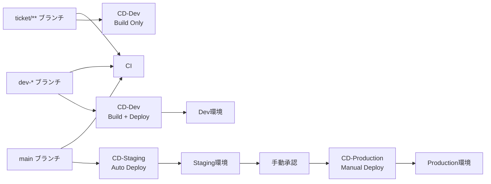

# CI/CD Workflows

TekuToko Backend の CI/CD パイプライン設定です。

## ワークフロー概要



## ワークフロー一覧

### 1. CI (Continuous Integration)
**ファイル**: `backend-ci.yml`
**トリガー**: PR作成/更新、main/dev-*ブランチへのpush、ticket/**ブランチへのpush

#### ジョブ構成
1. **lint**: golangci-lint によるコード品質チェック
2. **test**: ユニットテスト実行 + カバレッジ計測
3. **build**: バイナリビルド確認
4. **security-scan**: Gosec によるセキュリティスキャン

#### 必要なSecrets
なし（PostgreSQLはGitHub Actionsのservicesで起動）

---

### 2. CD - Dev (Continuous Deployment)
**ファイル**: `backend-cd-dev.yml`
**トリガー**: dev-*ブランチへのpush、ticket/**ブランチへのpush、手動実行

#### デプロイフロー
1. **build-and-push**: Dockerイメージビルド → Artifact Registry へpush
2. **deploy-to-gke**: GKE Dev クラスタへデプロイ（dev-*ブランチのみ）
3. **notify**: デプロイ結果通知（Slack等）

#### 必要なSecrets
| Secret名 | 説明 |
|---------|------|
| `GCP_PROJECT_ID` | GCPプロジェクトID |
| `GCP_WORKLOAD_IDENTITY_PROVIDER` | Workload Identity プロバイダー |
| `GCP_SERVICE_ACCOUNT_DEV` | Dev環境デプロイ用サービスアカウント |

#### デプロイ先
- **GKEクラスタ**: `tekutoko-dev`
- **リージョン**: `asia-northeast1`
- **イメージタグ**: `<commit-sha>`, `dev-latest`

#### 特徴
- ticket/**ブランチでは**イメージビルドのみ**実行（デプロイはスキップ）
- dev-*ブランチでは**ビルド+デプロイ**を自動実行
- 開発中の機能を素早くDev環境で検証可能

---

### 3. CD - Staging (Continuous Deployment)
**ファイル**: `backend-cd-staging.yml`
**トリガー**: mainブランチへのpush、手動実行

#### デプロイフロー
1. **build-and-push**: Dockerイメージビルド → Artifact Registry へpush
2. **deploy-to-gke**: GKE Staging クラスタへデプロイ
3. **notify**: デプロイ結果通知（Slack等）

#### 必要なSecrets
| Secret名 | 説明 |
|---------|------|
| `GCP_PROJECT_ID` | GCPプロジェクトID |
| `GCP_WORKLOAD_IDENTITY_PROVIDER` | Workload Identity プロバイダー |
| `GCP_SERVICE_ACCOUNT` | デプロイ用サービスアカウント |

#### デプロイ先
- **GKEクラスタ**: `tekutoko-staging`
- **リージョン**: `asia-northeast1`
- **イメージタグ**: `<commit-sha>`, `staging-latest`

---

### 4. CD - Production (Continuous Deployment)
**ファイル**: `backend-cd-production.yml`
**トリガー**: 手動実行のみ（Manual Approval必須）

#### デプロイフロー
1. **approve-deployment**: 手動承認（GitHub Environment Protection Rules）
2. **deploy-to-gke**: GKE Production クラスタへデプロイ
3. **notify**: デプロイ結果通知

#### 必要なSecrets
| Secret名 | 説明 |
|---------|------|
| `GCP_PROJECT_ID` | GCPプロジェクトID |
| `GCP_WORKLOAD_IDENTITY_PROVIDER` | Workload Identity プロバイダー |
| `GCP_SERVICE_ACCOUNT_PROD` | 本番デプロイ用サービスアカウント |

#### デプロイ先
- **GKEクラスタ**: `tekutoko-production`
- **リージョン**: `asia-northeast1`
- **イメージタグ**: 手動指定（例: `staging-latest`, 特定のcommit SHA）

#### 本番デプロイ手順
1. GitHub Actions UIから「CD - Production」ワークフローを選択
2. 「Run workflow」をクリック
3. デプロイするイメージタグを入力（例: `staging-latest`）
4. Approve画面で承認
5. デプロイ完了を確認

---

## セットアップ手順

### 1. GitHub Secretsの設定
```bash
# GitHub リポジトリ設定 > Secrets and variables > Actions で追加
GCP_PROJECT_ID=your-project-id
GCP_WORKLOAD_IDENTITY_PROVIDER=projects/PROJECT_NUMBER/locations/global/workloadIdentityPools/POOL_NAME/providers/PROVIDER_NAME
GCP_SERVICE_ACCOUNT_DEV=github-actions-dev@your-project.iam.gserviceaccount.com
GCP_SERVICE_ACCOUNT=github-actions-staging@your-project.iam.gserviceaccount.com
GCP_SERVICE_ACCOUNT_PROD=github-actions-prod@your-project.iam.gserviceaccount.com
```

### 2. Workload Identity設定
```bash
# Dev環境用サービスアカウント作成
gcloud iam service-accounts create github-actions-dev \
  --display-name="GitHub Actions Dev Service Account"

# Staging環境用サービスアカウント作成
gcloud iam service-accounts create github-actions-staging \
  --display-name="GitHub Actions Staging Service Account"

# Production環境用サービスアカウント作成
gcloud iam service-accounts create github-actions-prod \
  --display-name="GitHub Actions Production Service Account"

# 各環境に必要な権限を付与（例: Dev環境）
gcloud projects add-iam-policy-binding PROJECT_ID \
  --member="serviceAccount:github-actions-dev@PROJECT_ID.iam.gserviceaccount.com" \
  --role="roles/container.developer"

gcloud projects add-iam-policy-binding PROJECT_ID \
  --member="serviceAccount:github-actions-dev@PROJECT_ID.iam.gserviceaccount.com" \
  --role="roles/artifactregistry.writer"

# Workload Identity バインディング（例: Dev環境）
gcloud iam service-accounts add-iam-policy-binding \
  github-actions-dev@PROJECT_ID.iam.gserviceaccount.com \
  --role="roles/iam.workloadIdentityUser" \
  --member="principalSet://iam.googleapis.com/projects/PROJECT_NUMBER/locations/global/workloadIdentityPools/github-pool/attribute.repository/OWNER/REPO"

# Staging, Production環境も同様に設定
```

### 3. GitHub Environment設定
本番デプロイには手動承認が必要なため、GitHub Environment Protection Rulesを設定：

1. リポジトリ設定 > Environments > 「New environment」
2. 環境名: `production`
3. 「Required reviewers」にチームメンバーを追加
4. 保存

---

## トラブルシューティング

### ビルドエラー
- `go.mod`/`go.sum`が最新か確認
- ローカルで`go mod tidy`実行後、再度push

### テスト失敗
- PostgreSQLマイグレーションが正しく実行されているか確認
- 環境変数が正しく設定されているか確認

### デプロイ失敗
- GKEクラスタが存在するか確認: `gcloud container clusters list`
- サービスアカウント権限を確認
- Kubernetesマニフェストが適用されているか確認

### ロールバック
本番環境でデプロイ失敗した場合：

```bash
# 前回のデプロイに戻す
kubectl rollout undo deployment/tekutoko-api -n default

# 特定のリビジョンに戻す
kubectl rollout history deployment/tekutoko-api -n default
kubectl rollout undo deployment/tekutoko-api --to-revision=N -n default
```

または、GitHub Actionsの「deployment-backup」アーティファクトをダウンロードして復元：

```bash
kubectl apply -f deployment-backup-YYYYMMDD-HHMMSS.yaml
```

---

## モニタリング

### デプロイ状況確認
```bash
# Podステータス確認
kubectl get pods -n default -l app=tekutoko-api

# ロールアウト履歴
kubectl rollout history deployment/tekutoko-api -n default

# ログ確認
kubectl logs -f deployment/tekutoko-api -n default
```

### CI/CD実行履歴
GitHub リポジトリ > Actions タブで確認

---

## 参考リンク
- [GitHub Actions - Workload Identity](https://github.com/google-github-actions/auth)
- [GKE Deployment](https://cloud.google.com/kubernetes-engine/docs/how-to/deploying-workloads)
- [golangci-lint](https://golangci-lint.run/)
- [Gosec](https://github.com/securego/gosec)
