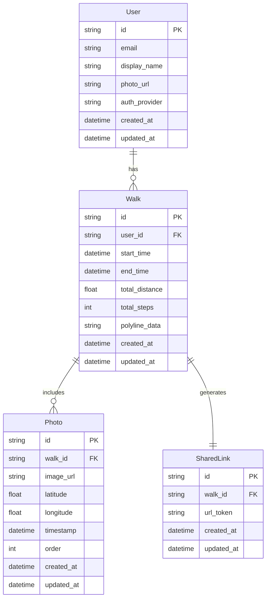
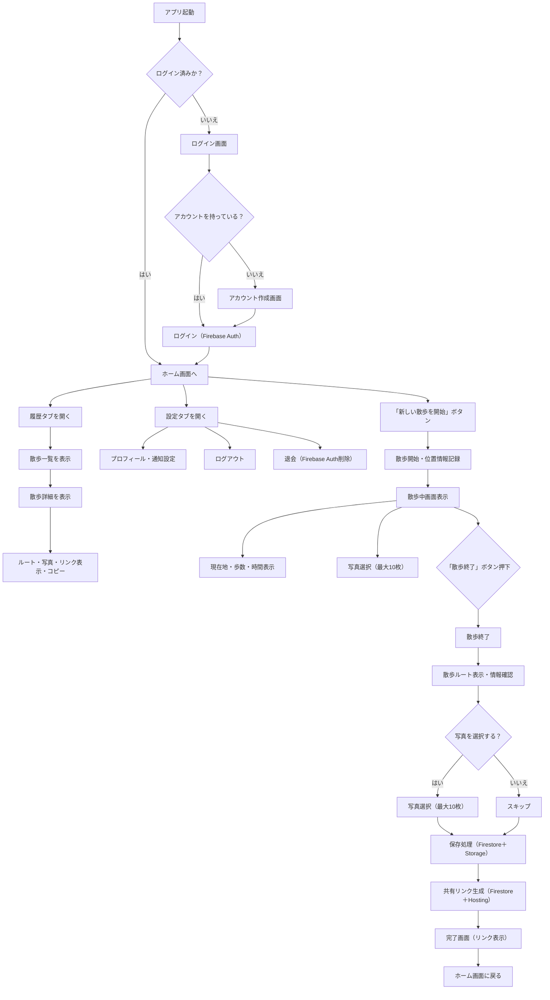
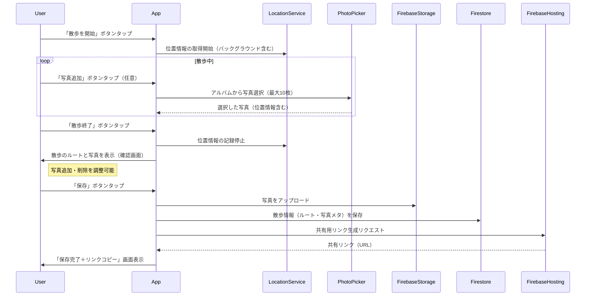
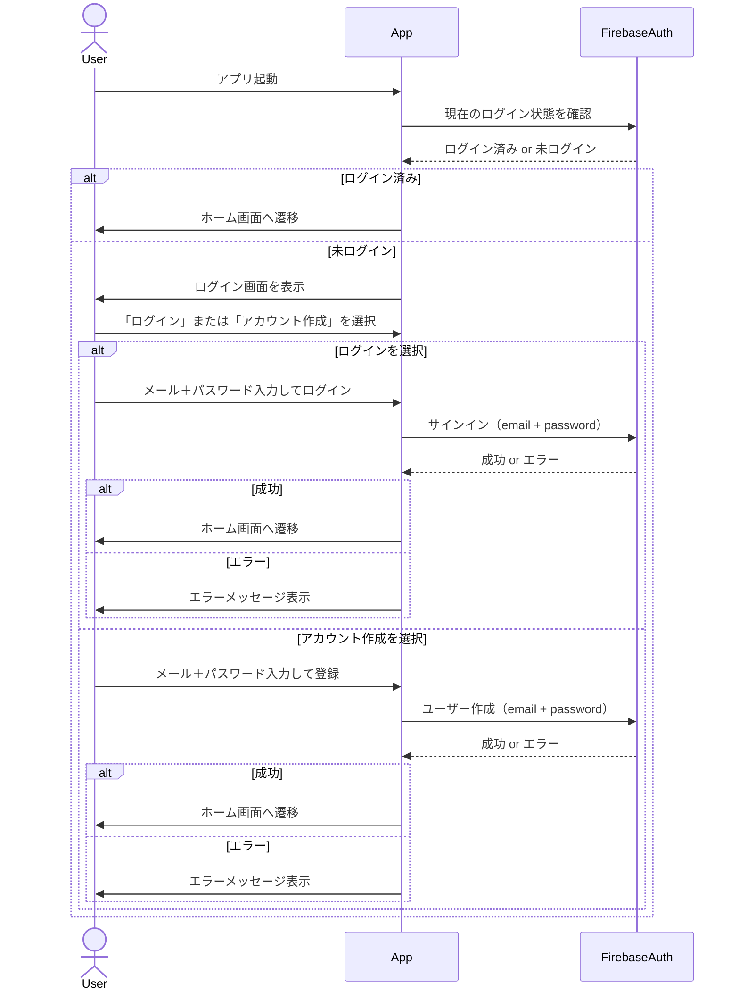
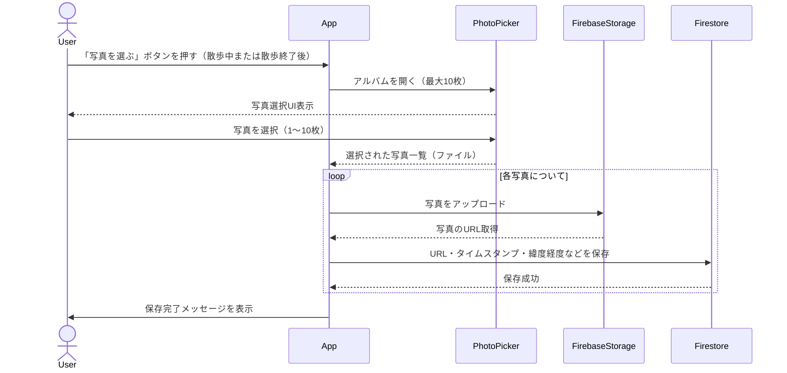
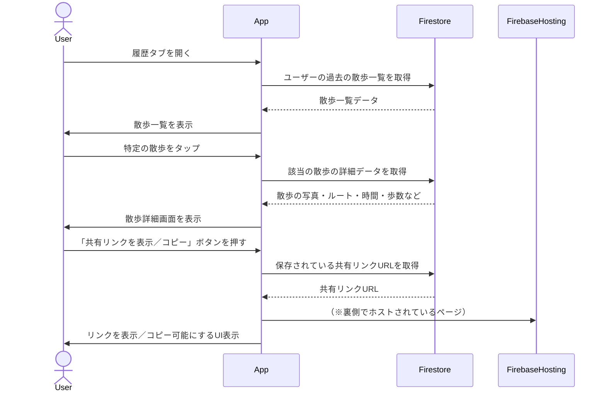

# TokoToko
* 「とことこ - おさんぽSNS」のリポジトリ
* このアプリは、「日常の散歩体験を、友人や家族と手軽に共有する」ことを目的としたSNS的な機能を持つサービスです。
* ただ歩くだけの時間を“楽しい体験”に変え、その記録を共有することで、新たな発見や会話が生まれることを目指します。

# 実行方法
## xcodeproj生成方法
* `make generate-xcodeproj`
    * xcodegen生成
    * podのインストール
    * xcodeprojを開く
```makefile
// Makefile
generate-xcodeproj:
    mint run xcodegen xcodegen generate
    pod install
    make open
open:
    open ./${PRODUCT_NAME}.xcworkspace
```
## シミュレータ起動方法
* `make xcode-run`
    * xcodegen生成
    * ビルド
    * シミュレータの起動
* `build`のあとに`test`を加えると全体のテストも実行されます
```makefile
// Makefile
xcode-run:
	mint run xcodegen xcodegen generate
	xcodebuild \
		-scheme $(PRODUCT_NAME) \
		-destination "platform=iOS Simulator,name=$(DEVICE_NAME),OS=$(OS_VERSION)" \
		-configuration Debug \
		build

	APP_PATH=$$HOME/Library/Developer/Xcode/DerivedData/$(PRODUCT_NAME)-*/Build/Products/Debug-iphonesimulator/$(PRODUCT_NAME).app && \
	xcrun simctl boot "$(DEVICE_NAME)" || true && \
	xcrun simctl install booted $$APP_PATH && \
	xcrun simctl launch booted $(BUNDLE_ID)
```
# ERD



- User
    - テーブル概要
        - ユーザーに関連する情報を格納するテーブル。
    - 属性
        - id (PK): ユーザーを一意に識別するID（主キー）
        - email: ユーザーのメールアドレス
        - display_name: アプリ内で表示されるユーザーの名前
        - photo_url: ユーザーのプロフィール画像URL
        - auth_provider: 認証の方法(GoogleやEmailなどの認証サービス)
- Walk
    - テーブル概要
        - 散歩記録に関する情報を格納するテーブル。ユーザーが行った散歩の詳細情報を保存する。
    - 属性
        - id (PK): 散歩の一意識別子
        - user_id (FK): 散歩を記録したユーザーのID（外部キー)
        - start_time: 散歩の開始時刻
        - end_time: 散歩の終了時刻
        - total_distance: 散歩した総距離
        - total_steps: 散歩中に歩いた総歩数
        - polyline_data: 散歩ルートを表すデータ（地図上に表示する線の情報）
- Photo
    - テーブル概要
        - ユーザーが散歩中に撮影した写真に関する情報を格納するテーブル。
    - 属性
        - id (PK): 写真の一意識別子
        - walk_id (FK): この写真が関連する散歩のID（外部キー）
        - image_url: 写真が保存されているURL
        - latitude: 写真が撮影された場所の緯度
        - longitude: 写真が撮影された場所の経度
        - timestamp: 写真が撮影された時刻
        - rder: 複数枚の写真がある場合の表示順（1～10の番号など）
- SharedLink
    - テーブル概要
        - 散歩記録を共有するためのリンク情報を格納するテーブル。これによりユーザーはリンクを生成して他の人と散歩記録を共有できる。
    - 属性
        - id (PK): 共有リンクの一意識別子
        - walk_id (FK): 共有される散歩のID（外部キー）
        - url_token: 共有リンクを一意に識別するためのトークン

# FlowChart



# Sequence Diagrams

## 散歩の開始〜終了〜保存〜共有までのフロー



## ログインまたはアカウント作成のシーケンス図（Firebase Auth）



##  写真の選択と保存処理の連携（最大10枚）



## 履歴の散歩詳細表示〜共有リンクの再取得


