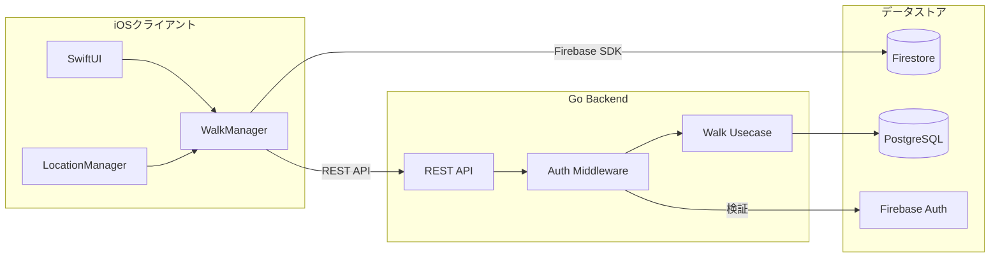

# TekuToko

「てくとこ - おさんぽSNS」のリポジトリ

## プロジェクト概要

このアプリは、「日常の散歩体験を、友人や家族と手軽に共有する」ことを目的としたSNS的な機能を持つサービスです。
ただ歩くだけの時間を"楽しい体験"に変え、その記録を共有することで、新たな発見や会話が生まれることを目指します。

## 全体アーキテクチャ



> **Note**: バックエンド移行のファーストフェーズとして、データ量の多い散歩記録（Walk）のCRUD操作をGoバックエンドに切り出しました。認証やプライバシーポリシー取得などの小さい処理は引き続きFirebase SDKで直接処理しており、今後段階的に移行予定です。

## リポジトリ構造

```
TekuToko/
├── frontend/                    # iOSアプリ (Swift)
│   ├── TekuToko/               # アプリ本体
│   ├── TekuTokoTests/          # 単体テスト
│   ├── TekuTokoUITests/        # UIテスト
│   ├── project.yml             # XcodeGen設定
│   └── ci_scripts/             # Xcode Cloud用スクリプト
├── backend/                     # バックエンドAPI (Go)
│   ├── cmd/                    # エントリーポイント
│   ├── internal/               # 内部パッケージ
│   ├── migrations/             # DBマイグレーション
│   └── deploy/                 # デプロイ設定
├── public/                      # 静的ファイル（利用規約等）
└── README.md                    # このファイル
```

## ドキュメント

### 📚 [APIドキュメント（iOS）](https://rrrrrrr-777.github.io/TokoToko/documentation/tekutoko/)

> 全SwiftファイルのAPI仕様書をWebサイト形式で確認できます（Apple公式DocC）

**詳細情報**:
* 全Swiftファイルの日本語DocCコメントを自動生成
* GitHub Actionsで自動更新（Swift 6 + Xcode 16対応）
* 主要コンポーネント: [Walk](https://rrrrrrr-777.github.io/TokoToko/documentation/tekutoko/walk/), [WalkManager](https://rrrrrrr-777.github.io/TokoToko/documentation/tekutoko/walkmanager/), [LocationManager](https://rrrrrrr-777.github.io/TokoToko/documentation/tekutoko/locationmanager/)

### 📖 その他ドキュメント

| ドキュメント | 説明 |
|-------------|------|
| [TekuTokoDocs](https://github.com/RRRRRRR-777/TekuTokoDocs) | 設計・仕様・議事録などの技術ドキュメント |
| [OpenAPI仕様書](./backend/docs/openapi.yaml) | バックエンドREST API仕様 |
| [データベーススキーマ](./backend/docs/database-schema.md) | PostgreSQLテーブル設計 |
| [デプロイアーキテクチャ](./backend/docs/deployment-architecture.md) | GKE Autopilot構成 |

---

## Frontend (iOS)

iOSネイティブアプリ。Swift 6 + SwiftUI で開発。

### 開発環境要件

- **Xcode**: 16.x 以上
- **macOS**: Sequoia 以上
- **Homebrew**: パッケージ管理

### セットアップ

#### 1. 依存ツールのインストール

```bash
# Homebrewをインストール（未インストールの場合）
# https://brew.sh/ja/

# XcodeGenをインストール
brew install xcodegen
```

#### 2. Xcodeプロジェクト生成

```bash
cd frontend
xcodegen generate
```

#### 3. 実行方法

**VSCode + SweetPadを使用する場合（推奨）**:

1. [SweetPad](https://marketplace.visualstudio.com/items?itemName=sweetpad.sweetpad)拡張機能をインストール
2. アクティビティバーで「TOOLS」から以下をインストール:
   - SwiftLint
   - xcbeautify
   - xcode-build-server
3. 「実行とデバッグ」からシミュレーターを起動

**Xcodeを使用する場合**:

```bash
cd frontend
open TekuToko.xcodeproj
```

### 主要コンポーネント

| コンポーネント | 説明 |
|---------------|------|
| `WalkManager` | 散歩セッション管理 |
| `LocationManager` | 位置情報取得・管理 |
| `WalkRepository` | データ永続化（Firebase/Go切替可能） |

---

## Backend (Go)

Go言語によるバックエンドAPI。GKE Autopilot + PostgreSQL で運用。

> **Note**: バックエンド機能は実装済みですが、現在はオフになっています。
> iOSアプリの `AppConfig.useGoBackend` フラグで有効化できます。

### 背景

従来はiOSクライアントが直接Firebase（Firestore/Auth/Storage）へアクセスしていましたが、Go言語によるバックエンドサーバーを新たに構築し、サーバー経由でのデータ管理も可能にしました。

これにより以下のメリットが得られます:

- **クライアント負荷の軽減**: 重い処理をサーバー側へオフロード可能
- **柔軟なデータ管理**: PostgreSQLによるリレーショナルデータ管理
- **運用性の向上**: スケールアウト、ヘルスチェック、監視基盤の整備

詳細は [#148 Go言語でのバックエンド実装](https://github.com/RRRRRRR-777/TokoToko/issues/148) を参照してください。

### アーキテクチャ

- **パターン**: Clean Architecture + DDD (Domain-Driven Design)
- **レイヤー構成**:
  - **Domain層**: エンティティ、値オブジェクト、リポジトリインターフェース
  - **Usecase層**: ビジネスロジック、アプリケーションフロー
  - **Interface層**: HTTP API、永続化アダプター
  - **Infrastructure層**: 外部サービス接続 (DB, Firebase, ロギング)

```
┌─────────────────────────────────────┐
│       Infrastructure Layer          │
│  (Database, Firebase, Logging)      │
├─────────────────────────────────────┤
│       Interface Layer               │
│  (HTTP Handlers, Repository Impl)   │
├─────────────────────────────────────┤
│       Usecase Layer                 │
│  (Application Business Logic)       │
├─────────────────────────────────────┤
│       Domain Layer                  │
│  (Entities, Value Objects)          │
└─────────────────────────────────────┘
```

### インフラ構成（GCP）


### 開発環境要件

- **Go**: 1.22.x 以上
- **Docker Desktop**: ローカル開発用
- **Make**: タスクランナー
- **gcloud CLI + kubectl**: GKE Autopilotデプロイ用
- **golangci-lint**: コード品質チェック用

### セットアップ

#### クイックスタート（推奨）

```bash
cd backend

# 開発環境を自動セットアップ
./scripts/dev-setup.sh
```

このスクリプトは以下を自動実行します:
- .envファイルの作成
- Dockerコンテナの起動
- PostgreSQLの起動確認
- 開発ツールのインストール確認

#### 手動セットアップ

```bash
cd backend

# Go依存パッケージ取得
go mod download

# 開発ツールインストール
make tools

# 環境変数設定
cp .env.example .env
vi .env

# PostgreSQLコンテナ起動
docker-compose up -d postgres

# マイグレーション実行
make migrate-up
```

### ローカル実行

```bash
cd backend

# APIサーバー起動
make run

# またはホットリロード有効で起動
make dev
```

APIサーバーは `http://localhost:8080` で起動します。

### テスト・リンティング

```bash
cd backend

# 全テスト実行
make test

# カバレッジ付きテスト
make test-coverage

# Lint実行
make lint

# フォーマット
make fmt
```

### データベースマイグレーション

**使用ツール**: `golang-migrate/migrate`

```bash
# インストール
go install -tags 'postgres' github.com/golang-migrate/migrate/v4/cmd/migrate@latest
```

#### 基本操作

```bash
cd backend

# データベース起動
make db-up

# マイグレーション適用
make migrate-up

# バージョン確認
make migrate-version

# ロールバック（1つ戻す）
make migrate-down

# 新しいマイグレーション作成
make migrate-create name=create_photos_table
```

#### テーブル構造

**usersテーブル**:
```sql
CREATE TABLE users (
    id VARCHAR(128) PRIMARY KEY,           -- Firebase Auth UID
    display_name VARCHAR(255) NOT NULL,
    auth_provider VARCHAR(50) NOT NULL,    -- email, google, apple
    created_at TIMESTAMP NOT NULL DEFAULT CURRENT_TIMESTAMP,
    updated_at TIMESTAMP NOT NULL DEFAULT CURRENT_TIMESTAMP
);
```

**walksテーブル**:
```sql
CREATE TABLE walks (
    id UUID PRIMARY KEY,
    user_id VARCHAR(128) NOT NULL REFERENCES users(id) ON DELETE CASCADE,
    title VARCHAR(255) NOT NULL,
    start_time TIMESTAMP,
    end_time TIMESTAMP,
    total_distance DOUBLE PRECISION NOT NULL DEFAULT 0,
    total_steps INTEGER NOT NULL DEFAULT 0,
    status VARCHAR(50) NOT NULL DEFAULT 'not_started',
    created_at TIMESTAMP NOT NULL DEFAULT CURRENT_TIMESTAMP,
    updated_at TIMESTAMP NOT NULL DEFAULT CURRENT_TIMESTAMP
);
```

### Seedデータ投入

```bash
cd backend

# Seedデータを投入
make seed
```

以下のテストユーザーにサンプルデータが作成されます:
- `test-user-001`, `test-user-002`, `test-user-003`
- 各状態の散歩データ（未開始、進行中、一時停止、完了）

### デプロイ

#### Kubernetesマニフェスト構成

```
backend/deploy/kubernetes/
├── base/                    # 全環境共通ベース
│   ├── deployment.yaml
│   ├── service.yaml
│   ├── ingress.yaml
│   └── hpa.yaml
└── overlays/
    ├── development/         # 開発環境（1-3レプリカ）
    ├── staging/             # ステージング（2-10レプリカ）
    └── production/          # 本番環境（3-20レプリカ）
```

#### CI/CDパイプライン

| トリガー | アクション |
|---------|-----------|
| PR作成 | テスト、Lint、マニフェスト検証 |
| devブランチマージ | Development環境へ自動デプロイ |
| mainブランチマージ | Staging環境へ自動デプロイ |
| 手動承認後 | Production環境へデプロイ |

詳細: [GitHub Actions セットアップガイド](./backend/docs/github-actions-setup.md)

---

## 共通事項

### ブランチ運用

| ブランチ | 用途 |
|---------|------|
| `main` | 本番運用ブランチ |
| `dev-*` (例: dev-1.0.0) | 開発用ブランチ |
| `ticket/*` (例: ticket/1) | 機能開発用ブランチ |

### コミットメッセージ規約

```
<type>: <description>

[optional body]
```

**Type**: `feat`, `fix`, `refactor`, `test`, `docs`, `chore`

### アプリバージョンの運用

| バージョン | 説明 |
|-----------|------|
| メジャー (X) | ユーザーにとって大きな追加や変更 |
| マイナー (X.X) | 大きくはないが追加や変更 |
| パッチ (X.X.X) | 障害時のパッチ修正や軽微な修正 |

---

## 開発チーム

- **プロジェクト**: TekuToko - おさんぽSNS
- **リポジトリ**: https://github.com/RRRRRRR-777/TokoToko
