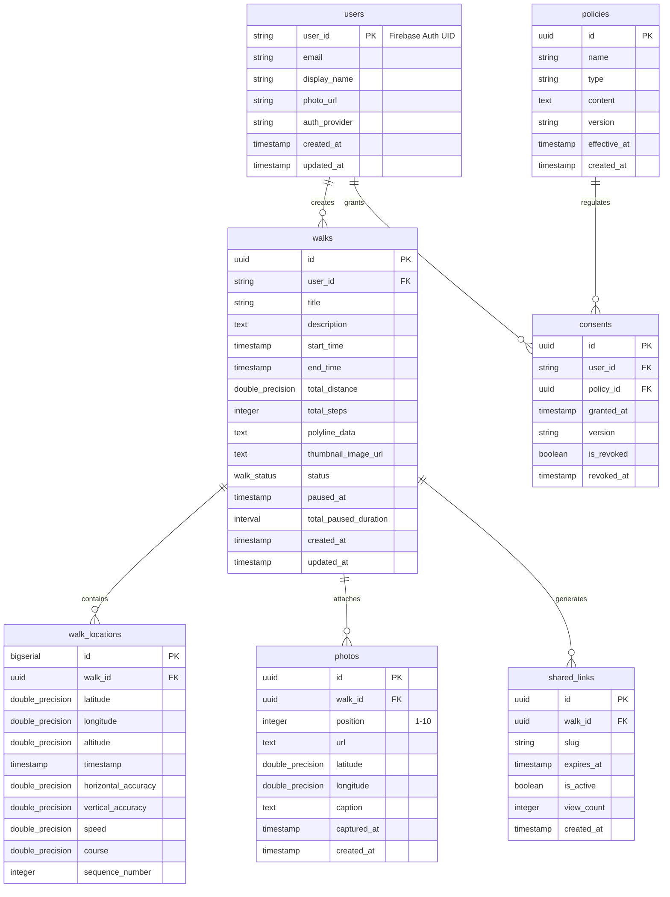

# データベーススキーマ設計

## ER図



## PostgreSQLスキーマ定義

### 1. ENUM型定義

```sql
-- 散歩ステータス
CREATE TYPE walk_status AS ENUM (
  'not_started',
  'in_progress',
  'paused',
  'completed'
);

-- 認証プロバイダー
CREATE TYPE auth_provider AS ENUM (
  'email',
  'google',
  'apple'
);

-- ポリシータイプ
CREATE TYPE policy_type AS ENUM (
  'privacy_policy',
  'terms_of_service'
);
```

### 2. テーブル定義

#### users テーブル
```sql
CREATE TABLE users (
  user_id VARCHAR(255) PRIMARY KEY,  -- Firebase Auth UID
  email VARCHAR(255) UNIQUE NOT NULL,
  display_name VARCHAR(255),
  photo_url TEXT,
  auth_provider auth_provider NOT NULL DEFAULT 'email',
  created_at TIMESTAMP NOT NULL DEFAULT NOW(),
  updated_at TIMESTAMP NOT NULL DEFAULT NOW()
);

CREATE INDEX idx_users_email ON users(email);
```

#### walks テーブル
```sql
CREATE TABLE walks (
  id UUID PRIMARY KEY DEFAULT gen_random_uuid(),
  user_id VARCHAR(255) NOT NULL REFERENCES users(user_id) ON DELETE CASCADE,
  title VARCHAR(255) NOT NULL,
  description TEXT DEFAULT '',
  start_time TIMESTAMP,
  end_time TIMESTAMP,
  total_distance DOUBLE PRECISION DEFAULT 0.0,
  total_steps INTEGER DEFAULT 0,
  polyline_data TEXT,
  thumbnail_image_url TEXT,
  status walk_status NOT NULL DEFAULT 'not_started',
  paused_at TIMESTAMP,
  total_paused_duration INTERVAL DEFAULT '0 seconds',
  created_at TIMESTAMP NOT NULL DEFAULT NOW(),
  updated_at TIMESTAMP NOT NULL DEFAULT NOW(),

  CONSTRAINT chk_walk_times CHECK (
    (start_time IS NULL AND end_time IS NULL) OR
    (start_time IS NOT NULL AND (end_time IS NULL OR end_time >= start_time))
  ),
  CONSTRAINT chk_total_distance CHECK (total_distance >= 0),
  CONSTRAINT chk_total_steps CHECK (total_steps >= 0)
);

-- インデックス設計
CREATE INDEX idx_walks_user_start_time ON walks(user_id, start_time DESC)
  INCLUDE (id, title, status);
CREATE INDEX idx_walks_status ON walks(status) WHERE status != 'completed';
CREATE INDEX idx_walks_created_at ON walks(created_at DESC);
```

#### walk_locations テーブル
```sql
CREATE TABLE walk_locations (
  id BIGSERIAL PRIMARY KEY,
  walk_id UUID NOT NULL REFERENCES walks(id) ON DELETE CASCADE,
  latitude DOUBLE PRECISION NOT NULL,
  longitude DOUBLE PRECISION NOT NULL,
  altitude DOUBLE PRECISION,
  timestamp TIMESTAMP NOT NULL,
  horizontal_accuracy DOUBLE PRECISION,
  vertical_accuracy DOUBLE PRECISION,
  speed DOUBLE PRECISION,
  course DOUBLE PRECISION,
  sequence_number INTEGER NOT NULL,

  CONSTRAINT chk_latitude CHECK (latitude BETWEEN -90 AND 90),
  CONSTRAINT chk_longitude CHECK (longitude BETWEEN -180 AND 180),
  CONSTRAINT uq_walk_sequence UNIQUE (walk_id, sequence_number)
);

-- インデックス設計
CREATE INDEX idx_walk_locations_walk_seq ON walk_locations(walk_id, sequence_number);
CREATE INDEX idx_walk_locations_walk_time ON walk_locations(walk_id, timestamp);
```

#### photos テーブル
```sql
CREATE TABLE photos (
  id UUID PRIMARY KEY DEFAULT gen_random_uuid(),
  walk_id UUID NOT NULL REFERENCES walks(id) ON DELETE CASCADE,
  position INTEGER NOT NULL CHECK (position BETWEEN 1 AND 10),
  url TEXT NOT NULL,
  latitude DOUBLE PRECISION,
  longitude DOUBLE PRECISION,
  caption TEXT,
  captured_at TIMESTAMP,
  created_at TIMESTAMP NOT NULL DEFAULT NOW(),

  CONSTRAINT uq_walk_photo_position UNIQUE (walk_id, position),
  CONSTRAINT chk_photo_latitude CHECK (latitude IS NULL OR (latitude BETWEEN -90 AND 90)),
  CONSTRAINT chk_photo_longitude CHECK (longitude IS NULL OR (longitude BETWEEN -180 AND 180))
);

CREATE INDEX idx_photos_walk_id ON photos(walk_id, position);
```

#### shared_links テーブル
```sql
CREATE TABLE shared_links (
  id UUID PRIMARY KEY DEFAULT gen_random_uuid(),
  walk_id UUID NOT NULL REFERENCES walks(id) ON DELETE CASCADE,
  slug VARCHAR(50) UNIQUE NOT NULL,
  expires_at TIMESTAMP,
  is_active BOOLEAN NOT NULL DEFAULT true,
  view_count INTEGER DEFAULT 0,
  created_at TIMESTAMP NOT NULL DEFAULT NOW(),

  CONSTRAINT chk_view_count CHECK (view_count >= 0)
);

CREATE INDEX idx_shared_links_slug ON shared_links(slug) WHERE is_active = true;
CREATE INDEX idx_shared_links_walk_id ON shared_links(walk_id);
```

#### policies テーブル
```sql
CREATE TABLE policies (
  id UUID PRIMARY KEY DEFAULT gen_random_uuid(),
  name VARCHAR(255) NOT NULL,
  type policy_type NOT NULL,
  content TEXT NOT NULL,
  version VARCHAR(50) NOT NULL,
  effective_at TIMESTAMP NOT NULL,
  created_at TIMESTAMP NOT NULL DEFAULT NOW(),

  CONSTRAINT uq_policy_type_version UNIQUE (type, version)
);

CREATE INDEX idx_policies_type_effective ON policies(type, effective_at DESC);
```

#### consents テーブル
```sql
CREATE TABLE consents (
  id UUID PRIMARY KEY DEFAULT gen_random_uuid(),
  user_id VARCHAR(255) NOT NULL REFERENCES users(user_id) ON DELETE CASCADE,
  policy_id UUID NOT NULL REFERENCES policies(id),
  granted_at TIMESTAMP NOT NULL DEFAULT NOW(),
  version VARCHAR(50) NOT NULL,
  is_revoked BOOLEAN NOT NULL DEFAULT false,
  revoked_at TIMESTAMP,

  CONSTRAINT chk_revoked CHECK (
    (is_revoked = false AND revoked_at IS NULL) OR
    (is_revoked = true AND revoked_at IS NOT NULL)
  )
);

CREATE INDEX idx_consents_user_policy ON consents(user_id, policy_id, granted_at DESC);
```

### 3. トリガー定義

#### updated_at自動更新トリガー
```sql
CREATE OR REPLACE FUNCTION update_updated_at_column()
RETURNS TRIGGER AS $$
BEGIN
  NEW.updated_at = NOW();
  RETURN NEW;
END;
$$ LANGUAGE plpgsql;

CREATE TRIGGER update_users_updated_at
  BEFORE UPDATE ON users
  FOR EACH ROW
  EXECUTE FUNCTION update_updated_at_column();

CREATE TRIGGER update_walks_updated_at
  BEFORE UPDATE ON walks
  FOR EACH ROW
  EXECUTE FUNCTION update_updated_at_column();
```

## 設計判断の根拠

### 1. 分離テーブル vs JSONB

**walk_locations を分離テーブルとして設計した理由:**
- ✅ 位置情報の個別クエリ・フィルタリングが容易
- ✅ sequence_numberによる順序保証
- ✅ 時系列クエリのパフォーマンス最適化
- ✅ 将来的なPostGIS拡張の可能性

**JSONB型を採用しなかった理由:**
- ❌ 全体の再書き込みが必要（部分更新が困難）
- ❌ 個別ポイントのインデックス化が複雑
- ❌ 大量の位置データでパフォーマンス低下

### 2. インデックス戦略

| テーブル | インデックス | 目的 |
|---------|-------------|------|
| walks | `(user_id, start_time DESC)` | ユーザー別散歩一覧（最新順） |
| walks | `(status)` | ステータスフィルタリング |
| walk_locations | `(walk_id, sequence_number)` | 位置情報の順序取得 |
| photos | `(walk_id, position)` | 写真の順序取得 |
| shared_links | `(slug)` | 共有リンクの高速検索 |

### 3. 制約設計

- **CHECK制約**: データ整合性保証（緯度経度範囲、写真枚数上限）
- **UNIQUE制約**: 重複防止（walk_id + sequence_number、walk_id + position）
- **FK制約**: 参照整合性（ON DELETE CASCADE）

## マイグレーション戦略

### Phase 2で実施（一括移行）
1. **エクスポート**: Firestore → JSON
2. **変換**: JSON → PostgreSQL INSERT文生成
3. **インポート**: PostgreSQLへバッチインサート
4. **検証**: データ整合性チェック、カウント比較
5. **切り替え**: アプリケーション設定変更

### 移行スクリプト構成
```
backend/
  migrations/
    001_create_enums.sql
    002_create_users.sql
    003_create_walks.sql
    004_create_walk_locations.sql
    005_create_photos.sql
    006_create_shared_links.sql
    007_create_policies.sql
    008_create_consents.sql
    009_create_triggers.sql
    010_create_indexes.sql
```

## 関連ドキュメント
- [要件定義書](./requirements.md)
- [通信プロトコル決定書](./communication-protocol.md)
