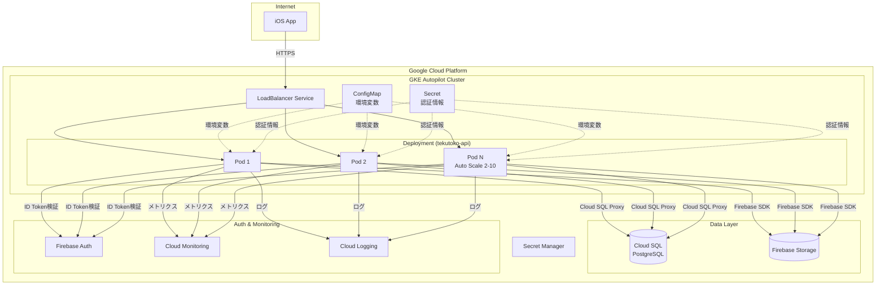
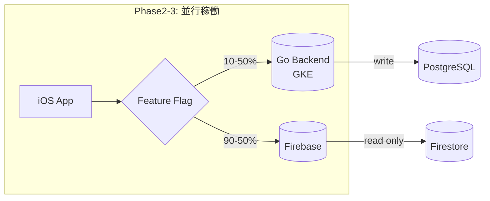

# デプロイアーキテクチャ設計

## 決定事項

**採用環境**: Google Kubernetes Engine (GKE) Autopilot

## 選定理由

### 1. 学習目的との適合性

**今回の選定判断根拠**:
- ✅ **Kubernetes学習**: 負荷分散と冗長構成を自前で学習できる
- ✅ **実装負荷最小化**: GKE Autopilotで運用負荷を抑える
- ✅ **スケーリング容易性**: レプリカ数を2〜10台まで簡単に変更可能
- ✅ **将来性**: 大規模化にも対応できる基盤

### 2. 要件との適合性

| 要件 | GKE Autopilot | 評価 |
|------|---------------|------|
| 同時接続500人 | ✅ 十分対応可能 | 2-10レプリカで余裕（※Phase2で負荷試験実施） |
| レイテンシ500ms以内 | ✅ 達成可能 | 常時起動でコールドスタートなし（※p95 500ms目標） |
| 可用性99.9% | ✅ SLA 99.95% | 要件を上回る（※マルチゾーン+HA構成必須） |
| Kubernetes学習 | ✅ 本格的に学べる | Pod/Deployment/Service等 |

**性能要件の根拠** (Phase2で詳細検証):
- **目標QPS**: 10 req/sec（同時接続500人、平均50秒/リクエスト想定）
- **Podリソース根拠**: 500mCPU/512Mi×2レプリカで約20 req/secまで対応可能（Go APIの一般的な性能指標）
- **負荷試験計画**: Apache Bench/Locustで段階的負荷テスト（10, 50, 100, 500同時接続）実施予定

### 3. 技術スタック比較

| 項目 | Cloud Run | GKE Autopilot | GKE Standard |
|------|-----------|---------------|--------------|
| 月額コスト（概算） | $65 | $150 | $300-500 |
| 運用負荷 | 低 | 中 | 高 |
| Kubernetes学習 | ❌ | ✅ | ✅ |
| スケーリング容易性 | 自動 | 簡単（1コマンド） | 手動設定 |
| レプリカ数変更 | 制限あり | 1行変更で可能 | 手動設定 |
| ノード管理 | 不要 | 自動 | 手動 |

## アーキテクチャ戦略

### 結論：冗長化（単一アプリをスケール）を採用

現段階は**「冗長化（単一アプリを複数Podで運用）」**が最適です。
GKE Autopilotと相性がよく、少人数・初期リリースでの開発速度・運用のシンプルさ・コスト最適化を優先できます。将来負荷や組織規模が増したら、影響が大きい機能から段階的にマイクロサービス化を検討する方針です。

### 比較：冗長化 vs マイクロサービス

| 観点 | 冗長化（単一アプリを複数Pod） | マイクロサービス |
|------|------------------------------|------------------|
| **アーキ構造** | シンプル（単一コードベース＋1つのService） | 複雑（サービス分割・内部API設計が必要） |
| **デプロイ/CI** | 単一パイプラインで容易 | サービスごとに分散、パイプライン増加 |
| **スケーリング** | 全体を水平スケール（HPAでPod数調整） | 機能単位で最適スケールが可能 |
| **障害影響** | 全体に波及しやすい | サービス境界で限定されやすい |
| **観測性/監視** | 単純（ログ・メトリクスがまとまる） | サービス横断のトレーシングが必須で難度↑ |
| **ネットワーク** | 内部通信ほぼ不要で設計が簡単 | サービス間通信（認証・リトライ等）の設計が必要 |
| **コスト** | 少規模では安価になりやすい | サービス数に比例して基盤コスト増 |
| **開発速度** | 初期は高速（認知負荷が低い） | 増員・並行開発に強い（長期有利） |
| **チーム体制** | 少人数に最適 | 機能別チーム向き／境界の合意が必要 |
| **将来拡張** | 段階的分割を前提に設計すればOK | 初期から境界設計が要るが長期拡張性◎ |

### 冗長化を選ぶ主な理由（メリット）

- **シンプル & 早い**: 設計・運用・デプロイが一本化され、初期開発が加速
- **Autopilot適合**: ノード運用不要、HPAでPodスケールだけに集中
- **コスト最適**: 少サービス構成で固定費が膨らみづらい
- **運用容易**: 監視・トラブルシュートの論点が少ない

### 受け入れるデメリット（リスク）

- 一部の重い処理（例：画像処理）が全体に影響しやすい
- 障害時の影響範囲が広め（ただし冗長化で可用性は担保）
- 役割分離や独立スケールの細かな最適化は後回し

### 見直し基準（マイクロサービス化を検討するタイミング）

以下の状況になった場合、段階的なマイクロサービス化を検討します：

- **負荷特性の分離**: 特定機能だけ著しく負荷特性が異なる（例：画像処理/バッチ/推薦）
- **チーム規模拡大**: チームが機能別に増員され、独立デプロイが開発速度を上げると判断できる
- **SLO要件の分離**: SLO/SLA観点で機能別の信頼性要件が分かれ、隔離の価値が増す

## アーキテクチャ構成



**注記**: APIはHTTPS経由で公開されるため、技術的には任意のHTTPSクライアントから接続可能ですが、現状はiOSアプリのみをサポート対象としています。

## Kubernetes構成（最小構成）

### 必要なマニフェストファイル

```
backend/deploy/kubernetes/
├── base/
│   ├── deployment.yaml           # メインアプリケーション
│   ├── service.yaml              # LoadBalancer
│   ├── serviceaccount.yaml       # Workload Identity（必須）
│   ├── configmap.yaml            # 環境変数
│   ├── secret.yaml               # 認証情報（テンプレート）
│   ├── hpa.yaml                  # Auto Scaling（必須）
│   ├── poddisruptionbudget.yaml  # 可用性担保（必須）
│   ├── networkpolicy.yaml        # ネットワークセキュリティ（Phase4）
│   └── ingress.yaml              # HTTPS終端（Phase4）
└── README.md
```

**Phase2必須マニフェスト**: deployment, service, serviceaccount, configmap, secret, hpa, poddisruptionbudget
**Phase4追加マニフェスト**: networkpolicy, ingress

### 1. Deployment設定

```yaml
# deployment.yaml
apiVersion: apps/v1
kind: Deployment
metadata:
  name: tekutoko-api
  labels:
    app: tekutoko-api
spec:
  replicas: 2  # 初期レプリカ数（2-10の範囲で変更可能）
  selector:
    matchLabels:
      app: tekutoko-api
  template:
    metadata:
      labels:
        app: tekutoko-api
    spec:
      serviceAccountName: tekutoko-api-sa
      containers:
      - name: api
        image: gcr.io/PROJECT_ID/tekutoko-api:latest
        ports:
        - containerPort: 8080
          name: http
        env:
        - name: ENVIRONMENT
          valueFrom:
            configMapKeyRef:
              name: app-config
              key: environment
        - name: DB_HOST
          valueFrom:
            configMapKeyRef:
              name: app-config
              key: db_host
        - name: DB_PASSWORD
          valueFrom:
            secretKeyRef:
              name: app-secret
              key: db_password
        resources:
          requests:
            cpu: 500m
            memory: 512Mi
          limits:
            cpu: 1000m
            memory: 1Gi
        livenessProbe:
          httpGet:
            path: /health
            port: 8080
          initialDelaySeconds: 10
          periodSeconds: 30
        readinessProbe:
          httpGet:
            path: /ready
            port: 8080
          initialDelaySeconds: 5
          periodSeconds: 10

      # Cloud SQL Proxy サイドカー
      - name: cloud-sql-proxy
        image: gcr.io/cloud-sql-connectors/cloud-sql-proxy:latest
        args:
          - "--structured-logs"
          - "--port=5432"
          - "PROJECT_ID:REGION:INSTANCE_NAME"
        resources:
          requests:
            cpu: 100m
            memory: 128Mi
```

### 2. Service設定（LoadBalancer）

```yaml
# service.yaml
apiVersion: v1
kind: Service
metadata:
  name: tekutoko-api
spec:
  type: LoadBalancer
  selector:
    app: tekutoko-api
  ports:
  - port: 80
    targetPort: 8080
    protocol: TCP
    name: http
```

### 3. ConfigMap設定

```yaml
# configmap.yaml
apiVersion: v1
kind: ConfigMap
metadata:
  name: app-config
data:
  environment: "production"
  db_host: "localhost"
  db_port: "5432"
  db_name: "tekutoko"
  log_level: "info"
```

### 4. Secret設定（テンプレート）

```yaml
# secret.yaml (テンプレート - 実際の値は Secret Manager から取得)
apiVersion: v1
kind: Secret
metadata:
  name: app-secret
type: Opaque
data:
  db_password: BASE64_ENCODED_PASSWORD
  firebase_credentials: BASE64_ENCODED_JSON
```

### 5. HPA設定（Auto Scaling）

```yaml
# hpa.yaml
apiVersion: autoscaling/v2
kind: HorizontalPodAutoscaler
metadata:
  name: tekutoko-api-hpa
spec:
  scaleTargetRef:
    apiVersion: apps/v1
    kind: Deployment
    name: tekutoko-api
  minReplicas: 2
  maxReplicas: 10
  metrics:
  - type: Resource
    resource:
      name: cpu
      target:
        type: Utilization
        averageUtilization: 70
  - type: Resource
    resource:
      name: memory
      target:
        type: Utilization
        averageUtilization: 80
  # Phase4で追加予定: 外部メトリクス（リクエストレート/レイテンシ）
  # - type: External
  #   external:
  #     metric:
  #       name: custom.googleapis.com|request_latency_p95
  #     target:
  #       type: Value
  #       value: "500m"  # 500ms
```

### 6. PodDisruptionBudget設定（可用性担保）

```yaml
# poddisruptionbudget.yaml
apiVersion: policy/v1
kind: PodDisruptionBudget
metadata:
  name: tekutoko-api-pdb
spec:
  minAvailable: 1  # 最低1台は稼働維持
  selector:
    matchLabels:
      app: tekutoko-api
```

### 7. ServiceAccount設定（Workload Identity）

```yaml
# serviceaccount.yaml
apiVersion: v1
kind: ServiceAccount
metadata:
  name: tekutoko-api-sa
  annotations:
    iam.gke.io/gcp-service-account: tekutoko-api@PROJECT_ID.iam.gserviceaccount.com
```

## スケーリング戦略

### 手動スケーリング

#### レプリカ数変更（方法1: マニフェスト修正）
```bash
# deployment.yamlのreplicas: 2 → 8 に変更
kubectl apply -f deployment.yaml
```

#### レプリカ数変更（方法2: コマンド）
```bash
# 8台に増やす
kubectl scale deployment tekutoko-api --replicas=8

# 確認
kubectl get pods
```

### 自動スケーリング（HPA）

```bash
# HPA適用
kubectl apply -f hpa.yaml

# 確認
kubectl get hpa
```

**動作**:
- CPU使用率70%超え → レプリカ数増加
- メモリ使用率80%超え → レプリカ数増加
- 負荷減少 → 自動で最小2レプリカまで縮小

### スケーリング時間

| 操作 | 所要時間 |
|------|---------|
| 2 → 8台（手動） | 約30秒 |
| 8 → 2台（手動） | 約10秒 |
| HPA自動増加 | 1〜3分 |
| HPA自動減少 | 5分 |

## データベース接続

### Cloud SQL Proxy サイドカーパターン

**採用理由**:
- ✅ Kubernetesネイティブ
- ✅ 自動暗号化
- ✅ IAM認証サポート
- ✅ 各Podに専用Proxy

**接続方式**:
```
Go App (localhost:5432) → Cloud SQL Proxy (サイドカー) → Cloud SQL
```

## CI/CD パイプライン

### GitHub Actions ワークフロー

```yaml
name: Deploy to GKE

on:
  push:
    branches: [main]

jobs:
  deploy:
    runs-on: ubuntu-latest
    steps:
      - uses: actions/checkout@v4

      - id: auth
        uses: google-github-actions/auth@v2
        with:
          credentials_json: ${{ secrets.GCP_SA_KEY }}

      - name: Configure kubectl
        uses: google-github-actions/get-gke-credentials@v2
        with:
          cluster_name: tekutoko-cluster
          location: asia-northeast1

      - name: Build and Push Container
        run: |
          gcloud builds submit --tag gcr.io/$PROJECT_ID/tekutoko-api:$GITHUB_SHA

      - name: Update Deployment
        run: |
          kubectl set image deployment/tekutoko-api \
            api=gcr.io/$PROJECT_ID/tekutoko-api:$GITHUB_SHA

          kubectl rollout status deployment/tekutoko-api
```

### デプロイ戦略

**ローリングアップデート（デフォルト）**:
```yaml
# deployment.yamlに追加
spec:
  strategy:
    type: RollingUpdate
    rollingUpdate:
      maxSurge: 1        # 一度に1台増やす
      maxUnavailable: 0  # ダウンタイムなし
```

**段階的ロールアウト**:
1. 新バージョンを1台ずつ起動
2. 既存バージョンを1台ずつ停止
3. 全台置き換え完了

## 監視・ロギング

### Cloud Monitoring

**SLI指標**:
- レイテンシ: p50, p95, p99
- エラー率: 4xx, 5xx
- リクエスト数: QPS
- Pod CPU/メモリ使用率
- レプリカ数

### SLO定義

**Phase2で設定するSLO**:

| 指標 | SLO目標 | 測定期間 | Error Budget |
|------|---------|---------|-------------|
| 可用性 | 99.9% | 30日間 | 43分/月 |
| p95レイテンシ | < 500ms | 7日間 | 5%のリクエストが500ms超過可 |
| エラー率 | < 1% | 7日間 | 1%のリクエストがエラー可 |

**アラート設定**:
- 可用性 < 99.5% → Slack通知 + メール
- p95レイテンシ > 600ms （10分継続）→ Slack通知
- エラー率 > 3% （5分継続）→ PagerDuty + Slack
- Error Budget消費率 > 80% → Slack警告

**通知経路**:
1. Slack: `#tekutoko-alerts` チャンネル
2. Email: チームメーリングリスト
3. PagerDuty: クリティカルアラートのみ（Phase4）

### Cloud Logging

**構造化ログ（JSON）**:
```json
{
  "severity": "INFO",
  "message": "Walk created",
  "walk_id": "uuid",
  "user_id": "firebase_uid",
  "pod_name": "tekutoko-api-xxxx",
  "timestamp": "2025-10-20T..."
}
```

### kubectl監視コマンド

```bash
# Pod一覧
kubectl get pods

# ログ確認
kubectl logs -f deployment/tekutoko-api

# リソース使用状況
kubectl top pods

# HPA状態
kubectl get hpa

# イベント確認
kubectl get events --sort-by='.lastTimestamp'
```

## セキュリティ

### IAM権限

**Workload Identity（推奨）**:
```yaml
# Kubernetes Service Account → GCP Service Account
apiVersion: v1
kind: ServiceAccount
metadata:
  name: tekutoko-api-sa
  annotations:
    iam.gke.io/gcp-service-account: tekutoko-api@PROJECT_ID.iam.gserviceaccount.com
```

**GCP権限**:
- Cloud SQL Client
- Secret Manager Accessor
- Firebase Admin

### ネットワークセキュリティ

- **LoadBalancer**: HTTPS終端（Phase4でIngressに移行）
- **Cloud Armor**: DDoS対策（Phase4で追加）
- **Private Cluster**: ノードはプライベートIP（Autopilotデフォルト）
- **NetworkPolicy**: Pod間通信制限（Phase4で追加）

### セキュリティ強化施策（Phase2実装項目）

**Secret Manager CSI Driver**:
```yaml
# deployment.yamlに追加
volumes:
- name: secrets-store
  csi:
    driver: secrets-store.csi.k8s.io
    readOnly: true
    volumeAttributes:
      secretProviderClass: "tekutoko-secrets"
```

**脆弱性スキャン**:
- Container: Artifact Registry自動スキャン有効化
- Go modules: `go list -m all | nancy sleuth` (CI/CD組み込み)
- Dependabot: GitHub Dependabot有効化

**IAM最小権限レビュー**:
- GCP Service Account権限: Cloud SQL Client, Secret Manager Accessor, Firebase Adminのみ
- Workload Identityで不要な権限を排除

### バックアップ・災害復旧（RTO/RPO）

**Phase2設定値**:
- **RTO (目標復旧時間)**: 4時間
- **RPO (目標復旧時点)**: 1時間

**Cloud SQL バックアップ**:
- 自動バックアップ: 毎日 03:00 JST
- ポイントインタイムリカバリ: 7日間保持
- リージョン間レプリケーション: Phase4で検討

**リストア手順**:
1. Cloud SQL インスタンスから特定時点に復元
2. 新インスタンスのエンドポイントをConfigMapに反映
3. Deployment再起動（5-10分）

## コスト試算

### 月額コスト概算（500同時接続想定）

| サービス | 使用量 | 月額コスト |
|---------|--------|----------|
| GKE Autopilot | 平均3 Pods × 730h (500mCPU/512Mi) | $110 |
| Cloud SQL (HA) | db-custom-2-4（2 vCPU, 4GB）+ HA | $85 |
| Firebase Storage | 100GB + 転送 | $10 |
| Cloud Logging | 50GB/月 | $2.50 |
| Cloud Monitoring | 標準メトリクス | $0 |
| LoadBalancer | 1個 | $18 |
| **合計** | | **約$225.50 (¥34,000)** |

**⚠️ コスト試算の前提**:
- Cloud SQL: 500同時接続に対応するため`db-custom-2-4` (2 vCPU, 4GB) + HA構成を想定
- 旧試算の`db-f1-micro`(メモリ0.6GB)では同時接続数に対応不可
- GKE Autopilot: リソース使用量ベース課金（CPU/メモリのrequest/limit値から算出）
- Phase2で実負荷試験後、スペックを最終調整

### スケールアップ時（レプリカ数別）

| レプリカ数 | GKE Autopilot | Cloud SQL (HA) | 合計月額 |
|-----------|--------------|----------------|---------|
| 2台（最小） | $75 | $85 | $188 |
| 4台 | $145 | $85 | $258 |
| 8台 | $285 | $85 | $398 |
| 10台（最大） | $355 | $85 | $468 |

**コスト削減策** (Phase4以降):
- Committed Use Discounts (1年契約で約37%割引)
- Budget Alerts設定（月額$500超過で通知）
- ログ保持期間最適化（30日→7日で50%削減）

## Infrastructure as Code (IaC)

### Terraform必須化

**方針**: 全てのGCPリソースをTerraformで管理（必須）

### Terraform構成

```
backend/deploy/terraform/
├── environments/
│   ├── dev/
│   │   ├── main.tf
│   │   ├── terraform.tfvars
│   │   └── backend.tf
│   ├── staging/
│   │   └── ...
│   └── prod/
│       └── ...
├── modules/
│   ├── gke-autopilot/
│   │   ├── main.tf
│   │   ├── variables.tf
│   │   └── outputs.tf
│   ├── cloud-sql/
│   │   └── ...
│   ├── firebase-storage/
│   │   └── ...
│   └── iam/
│       └── ...
└── README.md
```

### 管理対象リソース

```hcl
# modules/gke-autopilot/main.tf
resource "google_container_cluster" "primary" {
  name     = var.cluster_name
  location = var.region

  # Autopilot有効化
  enable_autopilot = true

  # Workload Identity有効化
  workload_identity_config {
    workload_pool = "${var.project_id}.svc.id.goog"
  }
}

# modules/cloud-sql/main.tf
resource "google_sql_database_instance" "main" {
  name             = var.instance_name
  database_version = "POSTGRES_15"
  region           = var.region

  settings {
    tier              = "db-custom-2-4"  # 2 vCPU, 4GB
    availability_type = "REGIONAL"       # HA構成

    backup_configuration {
      enabled                        = true
      point_in_time_recovery_enabled = true
      start_time                     = "03:00"
      transaction_log_retention_days = 7
    }
  }
}
```

### Terraform State管理

**方針**: Cloud Storage + KMS暗号化

```hcl
# environments/prod/backend.tf
terraform {
  backend "gcs" {
    bucket = "tekutoko-terraform-state"
    prefix = "prod/state"

    # KMS暗号化
    encryption_key = "projects/PROJECT_ID/locations/asia-northeast1/keyRings/terraform/cryptoKeys/state"
  }
}
```

### Secrets管理戦略

**Phase2実装方針**:
1. Secret Manager CSI Driverでk8s Secretに自動マウント
2. Terraform Variables: `terraform.tfvars`はgitignore、SOPS暗号化
3. 環境差分: dev/staging/prod で`terraform.tfvars`を分離

## Firebase/Go並行稼働戦略

### 移行アプローチ

**方針**: Firebase完全停止せず、段階的移行



### 並行稼働期間の構成

#### iOS側実装
```swift
// Phase2で追加実装
class APIConfig {
    static var useGoBackend: Bool {
        // Firebase Remote Configで動的制御
        RemoteConfig.remoteConfig()["use_go_backend"].boolValue
    }
}

class WalkRepositoryFactory {
    static func create() -> WalkRepository {
        return APIConfig.useGoBackend
            ? GoBackendWalkRepository()   // 新実装
            : FirebaseWalkRepository()     // 既存実装
    }
}
```

#### 段階的ロールアウト計画

| Week | Go比率 | 対象 | 検証項目 | 成功基準 | ロールバック基準 |
|------|--------|------|----------|---------|----------------|
| 1 | 10% | 開発チーム | 基本動作確認 | エラー率 < 1%, p95レイテンシ < 500ms | エラー率 > 5% |
| 2 | 30% | ベータユーザー | レイテンシ、エラー率 | 同上 + QPS 3件/秒達成 | エラー率 > 3% or p95 > 600ms |
| 3 | 50% | 一般ユーザー半分 | 負荷テスト | 同時接続250人達成、稼働率 > 99.5% | 稼働率 < 99% |
| 4 | 100% | 全ユーザー | 最終検証 | 同時接続500人達成、稼働率 > 99.9% | 稼働率 < 99.5% |

**ロールバック手順**:
1. Firebase Remote Configで`use_go_backend`を`false`に変更
2. 5分以内に全クライアントがFirebase経由に切り替わることを確認
3. Go Backend側のメトリクス/ログを保存し、原因分析

### データ同期戦略

**Phase2-3採用方式**: 二重書き（Write-Behind）

```
┌─────────┐
│ iOS App │
└────┬────┘
     │
     ▼
┌─────────────┐
│ Go Backend  │
└──┬────┬─────┘
   │    │
   │    └──────────┐
   ▼               ▼
┌──────────┐  ┌──────────┐
│PostgreSQL│  │Firestore │
│ (Primary)│  │(Fallback)│
└──────────┘  └──────────┘
```

**実装方針**:
- Go Backendが両DBに書き込み（PostgreSQL成功→Firestore非同期書き込み）
- 読み取りはPostgreSQLのみ
- Firestore書き込み失敗はログ記録のみ（非クリティカル）
- 100%移行後、Firestore書き込みを段階的に停止

### API互換性戦略

**Phase2実装方針**:
- APIバージョニング: `/v1/walks`
- iOS側で新旧API契約差異を吸収するAdapter層実装
- 互換性テストケース: 既存Firestore APIのレスポンス形式との完全一致確認

## 運用計画

### GKEクラスタ作成

```bash
# Autopilotクラスタ作成
gcloud container clusters create-auto tekutoko-cluster \
  --region=asia-northeast1 \
  --release-channel=regular

# kubectl設定
gcloud container clusters get-credentials tekutoko-cluster \
  --region=asia-northeast1
```

### 初回デプロイ

```bash
# マニフェスト適用
kubectl apply -f backend/deploy/kubernetes/base/

# 確認
kubectl get all
kubectl get svc tekutoko-api  # LoadBalancer IPを確認
```

### Phase2実装前の確認・追加項目

**性能関連**:
- [ ] 負荷試験計画書作成（目標QPS, 同時接続数, 測定方法）
- [ ] HPA/Podサイズの根拠資料作成
- [ ] 外部メトリクス（リクエストレート/レイテンシ）実装計画

**可用性関連**:
- [ ] Cloud SQL HA構成の詳細設計
- [ ] PodDisruptionBudget設定値の決定
- [ ] マルチゾーンデプロイ検証手順書
- [ ] 自動ロールバック設定の実装計画

**インフラIaC関連**:
- [ ] Terraform backend設定（Cloud Storage + KMS）
- [ ] Secrets管理方針（SOPS/Secret Manager CSI Driver）
- [ ] 環境差分管理戦略（dev/staging/prod）
- [ ] Terraformモジュール粒度の決定

**セキュリティ関連**:
- [ ] Workload Identityのサービスアカウント設計書
- [ ] Secret Manager CSI Driver導入計画
- [ ] NetworkPolicy/Ingress + TLS証明書管理計画（Phase4）
- [ ] 脆弱性スキャンCI/CD統合

**運用/監視関連**:
- [ ] SLOドキュメント作成
- [ ] Cloud Monitoringダッシュボード設計
- [ ] アラート設定詳細（閾値、通知経路）
- [ ] ログ保持期間と費用コントロール方針

**移行関連**:
- [ ] データ同期方式の詳細設計（二重書き実装）
- [ ] データ移行スクリプトの検証計画
- [ ] ロールアウト成功/失敗基準の明確化
- [ ] iOS側互換性テストケース作成

**コスト関連**:
- [ ] Autopilot/Cloud SQLの最終スペック見積
- [ ] 予算調整（月額$225 → ¥34,000）
- [ ] Budget Alerts設定（$500超過で通知）
- [ ] コスト削減策の優先順位付け

### Phase2（実装フェーズ）での作業
1. **Terraform構成作成**: GKE Autopilot、Cloud SQL (HA)、IAM、Secret Manager
2. **Kubernetesマニフェスト作成**: Deployment、Service、ServiceAccount、ConfigMap、Secret、HPA、PodDisruptionBudget
3. **Dockerfile作成**: マルチステージビルド、脆弱性スキャン統合
4. **CI/CD構築**: GitHub Actions設定、自動ロールバック
5. **監視設定**: SLI/SLO定義、アラート設定、ダッシュボード作成
6. **iOS側Repository抽象化**: Factory Pattern実装、Feature Flag統合、互換性テスト
7. **データ移行スクリプト**: Firestore→PostgreSQL変換、二重書き実装

### 運用タスク
- **日次**: `kubectl get pods`でPod状態確認、ログ確認、メトリクス確認
- **週次**: コストレビュー、パフォーマンスレビュー、レプリカ数調整
- **月次**: SLOレビュー、キャパシティプランニング

## Kubernetes学習パス

### Phase2で学べること（最小構成）

```
✅ Pod管理とログ確認（kubectl logs）
✅ Deploymentによる宣言的管理
✅ Serviceによるロードバランシング
✅ ConfigMap/Secret管理
✅ kubectl基本操作
✅ ローリングアップデート
✅ リソース管理（CPU/Memory）
```

### Phase4で学べること（拡張）

```
✅ HPA（Auto Scaling）
✅ Liveness/Readiness Probe
✅ Resource Limits調整
✅ Troubleshooting
```

### Phase6以降（さらなる拡張）

```
✅ Ingress（複数サービス時）
✅ Network Policy（セキュリティ強化時）
✅ StatefulSet（ステートフル対応時）
```

## 関連ドキュメント
- [要件定義書](./requirements.md)
- [通信プロトコル決定書](./communication-protocol.md)
- [データベーススキーマ](./database-schema.md)
- [API設計書](./openapi.yaml)
- [ネットワーク構成](./network-architecture.md)
