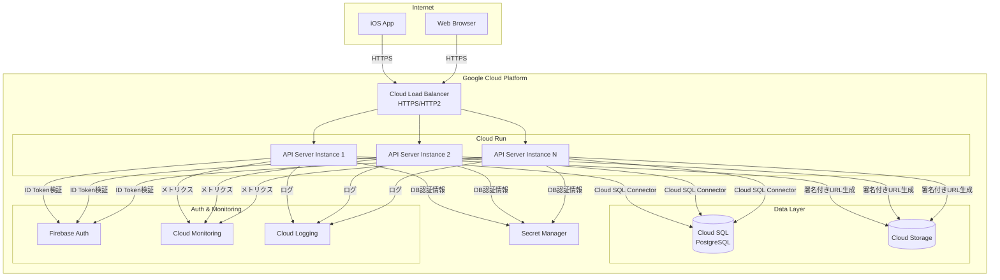
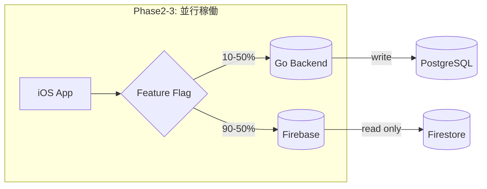

# デプロイアーキテクチャ設計

## 決定事項

**採用環境**: Google Cloud Run

## 選定理由

### 1. 要件との適合性

| 要件 | Cloud Run | 評価 |
|------|-----------|------|
| 同時接続500人 | ✅ 十分対応可能 | 自動スケーリングで余裕 |
| レイテンシ500ms以内 | ✅ 達成可能 | コールドスタート対策済み |
| 可用性99.9% | ✅ SLA 99.95% | 要件を上回る |

### 2. 学習価値とコストのバランス

**Cloud Run採用の判断根拠**:
- ✅ **Phase2実装に集中**: k8s運用ではなくGo API開発に注力
- ✅ **段階的学習**: まずAPI設計・実装を習得、後でk8sへ移行可能
- ✅ **コスト効率**: 初期段階で月額5,000円程度（GKE Autopilotは20,000円〜）
- ✅ **迅速なデプロイ**: CI/CDパイプライン構築が簡単

**将来的なGKE移行パス**:
- Phase5完了後、GKE Autopilotへの移行を検討
- コンテナイメージはそのまま利用可能
- 学習目的のk8s運用はその時点で習得

### 3. 技術スタック比較

| 項目 | Cloud Run | GKE Autopilot | GKE Standard |
|------|-----------|---------------|--------------|
| 月額コスト（概算） | $50-100 | $200-300 | $300-500 |
| 運用負荷 | 低 | 中 | 高 |
| スケーリング | 自動 | 自動 | 手動設定 |
| CI/CD複雑度 | 低 | 中 | 高 |
| 学習コスト | 低 | 中 | 高 |
| カスタマイズ性 | 制限あり | 中 | 高 |

## アーキテクチャ構成



## コンポーネント詳細

### Cloud Run設定

#### リソース設定
```yaml
resources:
  cpu: 1 vCPU
  memory: 512Mi
  max_instances: 10
  min_instances: 1  # コールドスタート対策
  concurrency: 80   # 1インスタンスあたりの同時リクエスト数
```

#### 環境変数
```
DATABASE_URL=postgres://...
GOOGLE_CLOUD_PROJECT=tekutoko-prod
FIREBASE_PROJECT_ID=tekutoko-ios
ENVIRONMENT=production
LOG_LEVEL=info
```

#### スケーリング戦略
- **最小インスタンス**: 1（コールドスタート回避）
- **最大インスタンス**: 10（500人 ÷ 80 concurrency = 7インスタンス + バッファ）
- **CPUスロットリング**: 1000m（1 vCPU）
- **メモリ**: 512Mi（Go APIサーバーとして十分）

### データベース接続

#### Cloud SQL接続方式
**Cloud SQL Connector（推奨）**を使用:
```go
import (
    "cloud.google.com/go/cloudsqlconn"
)

// Cloud SQL Connectorによる自動接続
// Unix socketまたはTCP接続を自動選択
```

**メリット**:
- ✅ IAM認証サポート
- ✅ 自動暗号化
- ✅ 接続プーリング最適化
- ✅ Private IP不要（Cloud SQL Proxyより簡単）

#### 接続プール設定
```go
db.SetMaxOpenConns(25)    // 最大接続数
db.SetMaxIdleConns(5)     // アイドル接続数
db.SetConnMaxLifetime(5 * time.Minute)
```

### ストレージ統合

#### Cloud Storage利用パターン
1. **写真アップロード**:
   - クライアント → API → 署名付きURL生成 → クライアント直接アップロード
   - サーバー負荷軽減、帯域節約

2. **サムネイル生成**:
   - Cloud Functionsでトリガー（将来実装）
   - 現状はクライアント側でリサイズ

### 監視・ロギング

#### Cloud Monitoring
- **SLI指標**:
  - レイテンシ: p50, p95, p99
  - エラー率: 4xx, 5xx
  - リクエスト数: QPS
  - DB接続数

#### Cloud Logging
- **構造化ログ（JSON）**:
```json
{
  "severity": "INFO",
  "message": "Walk created",
  "walk_id": "uuid",
  "user_id": "firebase_uid",
  "timestamp": "2025-10-20T...",
  "trace": "projects/tekutoko/traces/..."
}
```

#### アラート設定
- エラー率 > 5% → Slack通知
- レイテンシ p95 > 1秒 → Slack通知
- DB接続エラー → 即時通知

## CI/CD パイプライン

### GitHub Actions ワークフロー

```yaml
name: Deploy to Cloud Run

on:
  push:
    branches: [main]

jobs:
  deploy:
    runs-on: ubuntu-latest
    steps:
      - uses: actions/checkout@v4

      - id: auth
        uses: google-github-actions/auth@v2
        with:
          credentials_json: ${{ secrets.GCP_SA_KEY }}

      - name: Build and Push Container
        run: |
          gcloud builds submit --tag gcr.io/$PROJECT_ID/api:$GITHUB_SHA

      - name: Deploy to Cloud Run
        run: |
          gcloud run deploy tekutoko-api \
            --image gcr.io/$PROJECT_ID/api:$GITHUB_SHA \
            --region asia-northeast1 \
            --platform managed \
            --allow-unauthenticated \
            --min-instances 1 \
            --max-instances 10 \
            --cpu 1 \
            --memory 512Mi
```

### デプロイ戦略
- **ブルーグリーンデプロイ**: トラフィック分割機能を使用
- **段階的ロールアウト**:
  1. 新バージョンに10%トラフィック
  2. エラー率監視（5分）
  3. 問題なければ100%に切り替え

## セキュリティ

### IAM権限
```
Cloud Run Service Agent: 最小権限
Cloud SQL Client: DB接続のみ
Secret Manager Accessor: シークレット読み取りのみ
```

### ネットワークセキュリティ
- **Ingress制御**: 内部とCloud Load Balancerのみ許可
- **VPCコネクタ**: Cloud SQL Private IP接続（オプション）
- **Cloud Armor**: DDoS対策（将来実装）

## コスト試算

### 月額コスト概算（500同時接続想定）

| サービス | 使用量 | 月額コスト |
|---------|--------|----------|
| Cloud Run | 1 vCPU × 730h × 平均3インスタンス | $65 |
| Cloud SQL | db-f1-micro（1 vCPU, 3.75GB） | $25 |
| Cloud Storage | 100GB ストレージ + 転送 | $10 |
| Cloud Logging | 50GB/月 | $2.50 |
| Cloud Monitoring | 標準メトリクス | $0 |
| **合計** | | **約$102.50 (¥15,000)** |

### スケールアップ時（1000同時接続）
- Cloud Run: 平均6インスタンス → $130
- Cloud SQL: db-n1-standard-1 → $75
- **合計**: 約$220 (¥33,000)

## Infrastructure as Code (IaC)

### Terraform必須化

**方針**: 全てのGCPリソースをTerraformで管理（必須）

**理由**:
- ✅ インフラのバージョン管理
- ✅ 環境（dev/staging/prod）の再現性
- ✅ レビュープロセスの確立
- ✅ 学習目的でのIaC習得

### Terraform構成

```
backend/deploy/terraform/
├── environments/
│   ├── dev/
│   │   ├── main.tf
│   │   ├── terraform.tfvars
│   │   └── backend.tf
│   ├── staging/
│   │   └── ...
│   └── prod/
│       └── ...
├── modules/
│   ├── cloud-run/
│   │   ├── main.tf
│   │   ├── variables.tf
│   │   └── outputs.tf
│   ├── cloud-sql/
│   │   └── ...
│   ├── cloud-storage/
│   │   └── ...
│   ├── load-balancer/
│   │   └── ...
│   └── iam/
│       └── ...
└── README.md
```

### 管理対象リソース

```hcl
# backend/deploy/terraform/modules/cloud-run/main.tf
resource "google_cloud_run_service" "api" {
  name     = var.service_name
  location = var.region

  template {
    spec {
      containers {
        image = var.image
        resources {
          limits = {
            cpu    = "1000m"
            memory = "512Mi"
          }
        }
      }
      service_account_name = google_service_account.api.email
    }

    metadata {
      annotations = {
        "autoscaling.knative.dev/minScale" = "1"
        "autoscaling.knative.dev/maxScale" = "10"
      }
    }
  }
}
```

### Terraform運用フロー

```bash
# 環境別デプロイ
cd backend/deploy/terraform/environments/dev
terraform init
terraform plan
terraform apply

# 本番環境はGitHub ActionsからTerraform実行
```

## Firebase/Go並行稼働戦略

### 移行アプローチ

**方針**: Firebase完全停止せず、段階的移行



### 並行稼働期間の構成

#### iOS側実装
```swift
// Phase2で追加実装
class APIConfig {
    static var useGoBackend: Bool {
        // Firebase Remote Configで動的制御
        RemoteConfig.remoteConfig()["use_go_backend"].boolValue
    }
}

class WalkRepositoryFactory {
    static func create() -> WalkRepository {
        return APIConfig.useGoBackend
            ? GoBackendWalkRepository()   // 新実装
            : FirebaseWalkRepository()     // 既存実装
    }
}
```

#### 段階的ロールアウト計画

| Week | Go比率 | 対象 | 検証項目 |
|------|--------|------|----------|
| 1 | 10% | 開発チーム | 基本動作確認 |
| 2 | 30% | ベータユーザー | レイテンシ、エラー率 |
| 3 | 50% | 一般ユーザー半分 | 負荷テスト |
| 4 | 100% | 全ユーザー | 最終検証 |

#### ロールバック手順
```
1. Firebase Remote Config変更: use_go_backend = false
2. 即座に全ユーザーがFirebaseへ切り戻し（アプリ再起動不要）
3. 問題調査・修正
4. 再度段階的ロールアウト
```

### データ同期戦略

#### 初期データ移行
```bash
# Firestore → PostgreSQL 一括コピー（Phase2実施）
./scripts/migrate-firestore-to-postgres.sh

# 検証
./scripts/verify-data-integrity.sh
```

#### 並行稼働中の整合性
- **書き込み**: Goバックエンドのみ
- **読み取り**: Feature Flagで切り替え
- **バックアップ**: Firebaseデータは参照用に保持

## 運用計画

### Phase2（実装フェーズ）での作業
1. **Terraform構成作成**: モジュール設計、環境別設定
2. **Dockerfile作成**: マルチステージビルド
3. **Cloud Run設定**: Terraformで定義
4. **Cloud SQL構築**: Terraformで定義、マイグレーションスクリプト
5. **CI/CD構築**: GitHub Actions設定（Terraform統合）
6. **監視設定**: SLI/SLO定義、アラート設定
7. **iOS側Repository抽象化**: Factory Pattern実装、Feature Flag統合
8. **データ移行スクリプト**: Firestore→PostgreSQL変換

### Phase3（並行稼働フェーズ）での作業
1. **初期データ移行**: Firestore全データをPostgreSQLへコピー
2. **Feature Flag設定**: Firebase Remote Configで段階的制御
3. **10%ロールアウト**: 開発チームでテスト
4. **段階的拡大**: 10% → 30% → 50% → 100%
5. **Firebase読み取り専用化**: 書き込み停止、バックアップ保持

### 運用タスク
- **日次**: エラーログ確認、メトリクス確認、両バックエンドの整合性確認
- **週次**: コストレビュー、パフォーマンスレビュー、ロールアウト進捗確認
- **月次**: SLOレビュー、キャパシティプランニング、Firebase完全停止判断

## 将来的な移行パス

### GKE移行を検討する条件
1. **スケール要件**: 同時接続3000人超
2. **複雑な要件**: WebSocket常時接続、バッチ処理基盤等
3. **学習目的**: k8s運用スキル習得が目標になった場合

### 移行手順（概要）
1. GKE Autopilotクラスタ作成
2. 同じコンテナイメージをデプロイ
3. トラフィック段階的移行
4. Cloud Run停止

## 関連ドキュメント
- [要件定義書](./requirements.md)
- [通信プロトコル決定書](./communication-protocol.md)
- [データベーススキーマ](./database-schema.md)
- [API設計書](./openapi.yaml)
