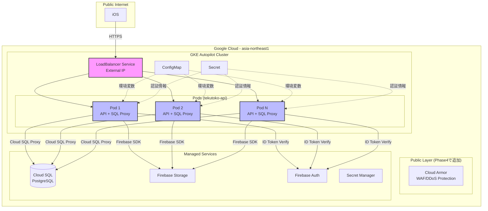
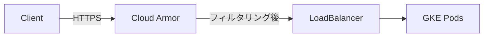

# ネットワーク構成設計

## 概要

GKE Autopilot環境でのネットワークアーキテクチャを定義します。
Kubernetesネイティブなロードバランシングとセキュリティ設計を含みます。

## ネットワーク構成図



## ネットワークコンポーネント

### 1. GKE Autopilot クラスタ

#### クラスタ構成
```
クラスタ名: tekutoko-cluster
リージョン: asia-northeast1
モード: Autopilot
リリースチャネル: regular
```

#### ネットワーク設定
- **VPC**: GKE Autopilotが自動作成
- **サブネット**: 自動管理（ノードとPod用）
- **Private Cluster**: デフォルトで有効（ノードはプライベートIP）
- **Master Authorized Networks**: 必要に応じて設定

### 2. Kubernetes LoadBalancer Service

#### Service設定
```yaml
apiVersion: v1
kind: Service
metadata:
  name: tekutoko-api
spec:
  type: LoadBalancer
  selector:
    app: tekutoko-api
  ports:
  - port: 80
    targetPort: 8080
    protocol: TCP
```

**動作**:
1. GCPが自動的にExternal Load Balancerを作成
2. LoadBalancerがPodに自動的にトラフィックを分散
3. ヘルスチェックでPodの状態を監視
4. 異常なPodにはトラフィックを送らない

### 3. Cloud SQL 接続方式

#### 採用: Cloud SQL Proxy サイドカーパターン

```
Pod構成:
├── api コンテナ (Go Application)
│   └── localhost:5432 に接続
└── cloud-sql-proxy コンテナ (サイドカー)
    └── Cloud SQL へProxyする
```

**メリット**:
- ✅ Kubernetesネイティブ
- ✅ 自動暗号化
- ✅ IAM認証サポート（Workload Identity）
- ✅ VPC不要（コスト削減）
- ✅ 各Podに専用Proxy

**Deployment設定例**:
```yaml
spec:
  containers:
  - name: api
    image: gcr.io/PROJECT_ID/tekutoko-api
    env:
    - name: DB_HOST
      value: "localhost"  # Cloud SQL Proxyサイドカーに接続
    - name: DB_PORT
      value: "5432"

  - name: cloud-sql-proxy
    image: gcr.io/cloud-sql-connectors/cloud-sql-proxy
    args:
      - "--port=5432"
      - "PROJECT_ID:REGION:INSTANCE_NAME"
```

### 4. Workload Identity（セキュリティ）

#### 概要
Kubernetes Service Account と GCP Service Account を紐付け

```
Kubernetes Pod
  ↓ (Workload Identity)
Kubernetes Service Account (tekutoko-api-sa)
  ↓ (IAM Binding)
GCP Service Account (tekutoko-api@PROJECT_ID.iam)
  ↓ (IAM Policy)
Cloud SQL / Secret Manager / Firebase
```

#### 設定手順

**1. GCP Service Account 作成**:
```bash
gcloud iam service-accounts create tekutoko-api \
  --display-name="TekuToko API Service Account"
```

**2. 権限付与**:
```bash
# Cloud SQL接続権限
gcloud projects add-iam-policy-binding PROJECT_ID \
  --member="serviceAccount:tekutoko-api@PROJECT_ID.iam.gserviceaccount.com" \
  --role="roles/cloudsql.client"

# Secret Manager読み取り権限
gcloud projects add-iam-policy-binding PROJECT_ID \
  --member="serviceAccount:tekutoko-api@PROJECT_ID.iam.gserviceaccount.com" \
  --role="roles/secretmanager.secretAccessor"
```

**3. Workload Identity バインディング**:
```bash
gcloud iam service-accounts add-iam-policy-binding \
  tekutoko-api@PROJECT_ID.iam.gserviceaccount.com \
  --role roles/iam.workloadIdentityUser \
  --member "serviceAccount:PROJECT_ID.svc.id.goog[default/tekutoko-api-sa]"
```

**4. Kubernetes Service Account**:
```yaml
apiVersion: v1
kind: ServiceAccount
metadata:
  name: tekutoko-api-sa
  annotations:
    iam.gke.io/gcp-service-account: tekutoko-api@PROJECT_ID.iam.gserviceaccount.com
```

### 5. トラフィックフロー

#### クライアント → API
```
iOS/Web Client
  ↓ HTTPS (Port 443/80)
LoadBalancer Service (External IP)
  ↓ HTTP (Port 8080)
Pod (tekutoko-api)
  ↓ Internal
Go Application
```

#### API → Cloud SQL
```
Go Application
  ↓ localhost:5432
Cloud SQL Proxy (サイドカー)
  ↓ Encrypted Connection
Cloud SQL (PostgreSQL)
```

#### API → Firebase Storage
```
Go Application
  ↓ HTTPS (Firebase Admin SDK)
Firebase Storage
```

## セキュリティ設計

### 1. ネットワークセキュリティ

#### Pod間通信
- **デフォルト**: 全Pod間で通信可能
- **Network Policy（Phase6で追加）**: 必要に応じて通信制限

#### Ingress制御
- **LoadBalancer**: インターネットからのHTTP/HTTPS受付
- **NodePort**: 無効（LoadBalancerのみ使用）

### 2. 認証・認可

#### API認証
```
1. クライアントがFirebase ID Tokenを取得
2. HTTPヘッダーに付与: Authorization: Bearer <token>
3. Go APIがFirebase Admin SDKで検証
4. 検証成功でリクエスト処理
```

#### サービス間認証
- **Workload Identity**: GCPサービスへのアクセス
- **Service Account**: Kubernetes内部での識別

### 3. Secret管理

#### 機密情報の保存
```
優先度1: Kubernetes Secret
  └── データベースパスワード、Firebase認証情報

優先度2: GCP Secret Manager (Phase4で追加)
  └── より厳密な管理が必要な場合
```

#### Secret作成
```bash
kubectl create secret generic app-secret \
  --from-literal=db_password=YOUR_PASSWORD \
  --from-file=firebase_credentials=firebase-creds.json
```

## Phase4: Cloud Armor 追加（将来実装）

### Cloud Armor（WAF/DDoS対策）



#### 設定内容
- **DDoS Protection**: 自動
- **Rate Limiting**: 100 req/sec/IP
- **地域制限**: 日本・米国のみ許可
- **SQLインジェクション対策**: 有効
- **XSS対策**: 有効

#### 導入タイミング
- Phase4（監視・冗長構成フェーズ）
- 本番リリース前に導入

## IPアドレス設計

### LoadBalancer External IP
```
タイプ: Ephemeral（動的）または Reserved（静的）
リージョン: asia-northeast1
用途: クライアントからのHTTPS接続
```

#### 静的IP予約（推奨：本番環境）
```bash
# 静的IP予約
gcloud compute addresses create tekutoko-api-ip \
  --region=asia-northeast1

# IPアドレス確認
gcloud compute addresses describe tekutoko-api-ip \
  --region=asia-northeast1
```

#### ServiceでIPを指定
```yaml
apiVersion: v1
kind: Service
metadata:
  name: tekutoko-api
spec:
  type: LoadBalancer
  loadBalancerIP: "RESERVED_IP_ADDRESS"  # 予約したIP
```

### Pod IP範囲
- **管理**: GKE Autopilotが自動管理
- **範囲**: クラスタ作成時に自動割り当て

## DNS設定

### ドメイン設定（Phase4）

```
api.tekutoko.com
  ↓ (A Record)
LoadBalancer External IP
```

#### Cloud DNS設定
```bash
# DNSゾーン作成
gcloud dns managed-zones create tekutoko-zone \
  --dns-name="tekutoko.com" \
  --description="TekuToko DNS Zone"

# Aレコード追加
gcloud dns record-sets transaction start --zone=tekutoko-zone
gcloud dns record-sets transaction add EXTERNAL_IP \
  --name=api.tekutoko.com \
  --ttl=300 \
  --type=A \
  --zone=tekutoko-zone
gcloud dns record-sets transaction execute --zone=tekutoko-zone
```

## モニタリング・ロギング

### ネットワークメトリクス

**Cloud Monitoring**:
- LoadBalancerリクエスト数
- LoadBalancerレイテンシ
- Pod間通信量
- Egress/Ingress帯域

**kubectl監視**:
```bash
# Service状態
kubectl get svc

# Endpoint確認（Podへのマッピング）
kubectl get endpoints

# ネットワークポリシー確認
kubectl get networkpolicy
```

### ログ

**Cloud Logging**:
- LoadBalancerアクセスログ
- Podアプリケーションログ
- Cloud SQL Proxyログ

## コスト試算

### ネットワーク関連コスト（月額）

| 項目 | 使用量 | 月額コスト |
|------|--------|----------|
| LoadBalancer | 1個 | $18 |
| Egress（アジア） | 100GB | $12 |
| Cloud Armor | - | $5（Phase4） |
| Cloud DNS | 1ゾーン | $0.40（Phase4） |
| **合計** | | **約$30** |

**注**: GKE AutopilotのネットワークコストはPod課金に含まれる

## Terraform管理

### ネットワークリソースのTerraform化

```hcl
# modules/network/main.tf

# 静的IP予約
resource "google_compute_address" "api_ip" {
  name   = "tekutoko-api-ip"
  region = var.region
}

# Cloud DNS（Phase4）
resource "google_dns_managed_zone" "tekutoko" {
  name     = "tekutoko-zone"
  dns_name = "tekutoko.com."
}

resource "google_dns_record_set" "api" {
  name         = "api.${google_dns_managed_zone.tekutoko.dns_name}"
  type         = "A"
  ttl          = 300
  managed_zone = google_dns_managed_zone.tekutoko.name
  rrdatas      = [google_compute_address.api_ip.address]
}
```

## Phase2実装時の作業

### 必須作業
1. GKE Autopilotクラスタ作成
2. Kubernetesマニフェスト適用
3. LoadBalancer Service作成
4. Cloud SQL Proxy設定
5. Workload Identity設定

### オプション作業（Phase4）
1. 静的IP予約
2. Cloud Armor設定
3. Cloud DNS設定
4. Network Policy設定

## 関連ドキュメント
- [deployment-architecture.md](./deployment-architecture.md)
- [phase1-summary.md](./phase1-summary.md)
- [Kubernetesマニフェスト](../deploy/kubernetes/)
- [GKE Networking](https://cloud.google.com/kubernetes-engine/docs/concepts/network-overview)
