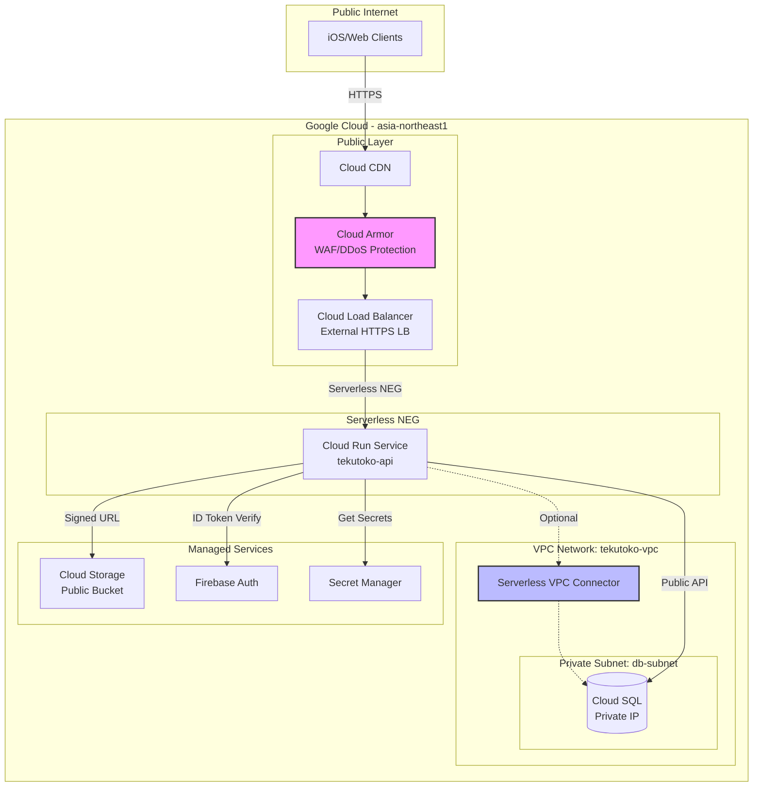

# ネットワーク構成設計

## 概要

Cloud Run環境でのネットワークアーキテクチャを定義します。
VPCコネクタによるプライベートネットワーク接続とセキュリティ設計を含みます。

## ネットワーク構成図



## ネットワークコンポーネント

### 1. VPC Network

#### VPC構成
```
VPC名: tekutoko-vpc
リージョン: asia-northeast1
サブネット:
  - db-subnet: 10.0.1.0/24 (Private)
  - connector-subnet: 10.0.2.0/28 (Serverless VPC Connector用)
```

#### Serverless VPC Connector
```yaml
name: tekutoko-connector
network: tekutoko-vpc
region: asia-northeast1
ip_cidr_range: 10.0.2.0/28
min_throughput: 200  # Mbps
max_throughput: 1000 # Mbps
```

**用途**:
- Cloud RunからCloud SQL Private IPへの接続（オプション）
- 将来的な内部サービス間通信

### 2. Cloud SQL接続方式

#### 推奨: Public IP + Cloud SQL Connector
```
メリット:
  ✅ VPC Connector不要（コスト削減）
  ✅ 自動暗号化
  ✅ IAM認証サポート
  ✅ セットアップ簡単

デメリット:
  ❌ Public IP経由（ただし暗号化済み）
```

#### オプション: Private IP + VPC Connector
```
メリット:
  ✅ 完全なプライベート接続
  ✅ ネットワーク分離

デメリット:
  ❌ VPC Connector月額$10-30
  ❌ 設定複雑
```

**Phase2採用**: Public IP + Cloud SQL Connector（コストと簡潔性優先）

### 3. Cloud Load Balancer

#### 構成
```yaml
type: External HTTPS Load Balancer
protocol: HTTPS/HTTP2
regions: Global (Multi-region)
backend:
  - Cloud Run Serverless NEG
ssl_policy: MODERN
  min_tls_version: TLS 1.2
```

#### SSL証明書
```
方式: Google-managed SSL Certificate
ドメイン: api.tekutoko.app
自動更新: 有効
```

### 4. Cloud Armor（WAF/DDoS Protection）

#### セキュリティポリシー

**Phase2実装内容**:
```yaml
rules:
  # Rule 1: Rate Limiting
  - priority: 1000
    description: "Rate limit per IP"
    match:
      versioned_expr: SRC_IPS_V1
      config:
        src_ip_ranges: ["*"]
    rate_limit_options:
      conform_action: "allow"
      exceed_action: "deny(429)"
      rate_limit_threshold:
        count: 100
        interval_sec: 60

  # Rule 2: Geo-blocking (オプション)
  - priority: 2000
    description: "Allow Japan only"
    match:
      expr:
        expression: "origin.region_code != 'JP'"
    action: "deny(403)"

  # Rule 3: OWASP Top 10 Protection
  - priority: 3000
    description: "OWASP ModSecurity Core Rule Set"
    match:
      expr:
        expression: "evaluatePreconfiguredExpr('xss-stable')"
    action: "deny(403)"
```

### 5. Cloud CDN

#### キャッシュ戦略
```yaml
enabled: true
cache_mode: CACHE_ALL_STATIC
default_ttl: 3600  # 1時間
max_ttl: 86400     # 24時間
client_ttl: 3600

# キャッシュ対象外
negative_caching: false
bypass_cache_on_request_headers:
  - "Authorization"
```

**キャッシュ対象**:
- 共有リンク経由の散歩データ（`/v1/shares/{slug}`）
- 静的アセット（将来）

**キャッシュ対象外**:
- 認証が必要なエンドポイント
- POST/PATCH/DELETE リクエスト

## セキュリティ設計

### 1. ネットワークセキュリティ

#### Cloud Run Ingress制御
```yaml
ingress: INGRESS_TRAFFIC_INTERNAL_LOAD_BALANCER
# Cloud Load Balancer経由のみ許可
# 直接アクセス不可
```

#### Egress制御
```yaml
egress: PRIVATE_RANGES_ONLY
vpc_connector: tekutoko-connector
# VPC内リソースのみアクセス可能
```

### 2. ファイアウォールルール

#### Cloud SQL向けルール
```yaml
name: allow-cloudrun-to-cloudsql
direction: INGRESS
source_ranges: ["10.0.2.0/28"]  # VPC Connector subnet
target_tags: ["cloudsql-instance"]
allowed:
  - protocol: tcp
    ports: ["5432"]
```

### 3. IAM & サービスアカウント

#### Cloud Run用サービスアカウント
```yaml
name: tekutoko-api-sa@PROJECT_ID.iam.gserviceaccount.com
roles:
  - roles/cloudsql.client          # Cloud SQL接続
  - roles/secretmanager.secretAccessor  # Secret取得
  - roles/storage.objectCreator    # 署名付きURL生成
  - roles/logging.logWriter        # ログ書き込み
  - roles/monitoring.metricWriter  # メトリクス書き込み
```

### 4. Secret Manager統合

#### シークレット管理
```yaml
secrets:
  - name: database-url
    value: "postgresql://..."
    access: tekutoko-api-sa

  - name: firebase-service-account
    value: "{json_key}"
    access: tekutoko-api-sa

  - name: storage-signing-key
    value: "..."
    access: tekutoko-api-sa
```

## トラフィックフロー

### 1. 通常APIリクエスト（認証あり）

```
1. Client
   ↓ HTTPS Request + Authorization: Bearer <token>
2. Cloud CDN (bypass cache)
   ↓
3. Cloud Armor (Rate limit check)
   ↓
4. Cloud Load Balancer
   ↓
5. Cloud Run (Firebase ID Token検証)
   ↓
6. Cloud SQL (データ取得)
   ↓
7. Response → Client
```

### 2. 共有リンクリクエスト（認証なし）

```
1. Browser
   ↓ HTTPS Request /v1/shares/{slug}
2. Cloud CDN (cache hit → return)
   ↓ (cache miss)
3. Cloud Armor (Rate limit check)
   ↓
4. Cloud Load Balancer
   ↓
5. Cloud Run (slug検証)
   ↓
6. Cloud SQL (データ取得)
   ↓
7. Response (Cache-Control: public, max-age=3600)
   ↓
8. Cloud CDN (cache store)
   ↓
9. Browser
```

### 3. 写真アップロードフロー

```
1. Client
   ↓ POST /v1/walks/{id}/photos
2. Cloud Run (署名付きURL生成)
   ↓ Response: { "upload_url": "..." }
3. Client
   ↓ PUT {upload_url} (直接Cloud Storageへ)
4. Cloud Storage
   ↓ Upload成功
5. Client
   ↓ PATCH /v1/walks/{id}/photos/{id} (URL登録)
6. Cloud Run → Cloud SQL
```

## 監視・ロギング

### 1. VPC Flow Logs

```yaml
enabled: true
aggregation_interval: 5-sec
flow_sampling: 1.0  # 100%サンプリング（初期）
metadata: INCLUDE_ALL_METADATA
```

**用途**:
- トラフィック分析
- 異常検知
- セキュリティ監査

### 2. Cloud Load Balancer Logs

```yaml
enabled: true
sample_rate: 1.0  # 100%
```

**ログ内容**:
- リクエスト/レスポンスサイズ
- レイテンシ
- バックエンドレイテンシ
- ステータスコード

### 3. Cloud Armor Logs

```yaml
enabled: true
log_level: VERBOSE
```

**ログ内容**:
- ブロックされたリクエスト
- レート制限発動
- ルールマッチング

## DNS構成

### Cloud DNS設定

```
Zone: tekutoko.app
Records:
  - api.tekutoko.app A    -> Cloud Load Balancer IP
  - api.tekutoko.app AAAA -> Cloud Load Balancer IPv6
```

### SSL証明書

```
Type: Google-managed SSL Certificate
Domains:
  - api.tekutoko.app
Auto-renewal: Enabled
```

## コスト概算（ネットワーク関連）

| サービス | 月額コスト |
|---------|----------|
| Cloud Load Balancer | $18 (ルール5個) |
| Cloud Armor | $5 (ポリシー1個) |
| VPC Connector | $0 (未使用) |
| Cloud CDN | $0.02/GB (転送量次第) |
| Cloud DNS | $0.40 (ホストゾーン) |
| **合計** | **約$25** |

## Phase2実装タスク

### ネットワーク構築手順

1. **VPC作成**
```bash
gcloud compute networks create tekutoko-vpc \
  --subnet-mode=custom \
  --bgp-routing-mode=regional

gcloud compute networks subnets create db-subnet \
  --network=tekutoko-vpc \
  --region=asia-northeast1 \
  --range=10.0.1.0/24
```

2. **Cloud SQL構築** (Public IP)
```bash
gcloud sql instances create tekutoko-db \
  --database-version=POSTGRES_15 \
  --tier=db-f1-micro \
  --region=asia-northeast1 \
  --network=tekutoko-vpc \
  --no-assign-ip  # Private IPのみ（オプション）
```

3. **Cloud Run デプロイ**
```bash
gcloud run deploy tekutoko-api \
  --image=gcr.io/PROJECT/api:latest \
  --region=asia-northeast1 \
  --ingress=internal-and-cloud-load-balancing \
  --service-account=tekutoko-api-sa@PROJECT.iam
```

4. **Load Balancer構成**
```bash
gcloud compute backend-services create tekutoko-backend \
  --global \
  --load-balancing-scheme=EXTERNAL \
  --protocol=HTTPS

gcloud compute url-maps create tekutoko-lb \
  --default-service=tekutoko-backend
```

5. **Cloud Armor適用**
```bash
gcloud compute security-policies create tekutoko-policy
gcloud compute backend-services update tekutoko-backend \
  --security-policy=tekutoko-policy
```

## 関連ドキュメント
- [デプロイアーキテクチャ](./deployment-architecture.md)
- [セキュリティ設計](./security-design.md)（Phase4で作成）
